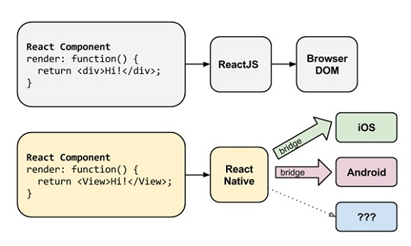

# React Native入门总结

最近三周，从零开始学习了当前较为火热的React Native技术，使用RN在iOS平台完成了一些小Demo和一个静态的商品详情页。整体来说，RN对于一个没有任何前端开发经验的Native程序员来说，学习曲线还是相当陡峭的。不仅要接触学习RN框架，还要掌握JS的语言特性和相关机制，而JS的编程习惯和一些规范，和此前理解的OO编程思想还是有相当大差异。此外，一项新兴的技术，其相关的参考资料和案例都是很少的。再加上RN的版本也在快速的迭代中，可能仅仅三个月前的Demo，在当前版本就已经不能运行了。因此，整个过程中还是踩了相当多的坑。当然，踩得坑多了，还是有些收获的。  
三周的学习，主要了解以下几个方面：  
1. 什么是React Native
2. iOS平台下，React Native是如何工作的
3. 学习JavaScript ES6标准
4. 搭建开发环境以及遇到的环境中的一些坑
5. IDE工作环境配置以及DeBug工具使用
6. 使用RN构建Demo的一些体会

## **1.关于React Native**

首先要了解什么是React Native，以下是官方的介绍：
>React Native enables you to build world-class application experiences on native platforms using a consistent developer experience based on JavaScript and React. The focus of React Native is on developer efficiency across all the platforms you care about - learn once, write anywhere. Facebook uses React Native in multiple production apps and will continue investing in React Native.  

根据官方介绍，可以了解到，React Native的核心同样是基于React框架的，只不过是针对Native平台做了相应的适配和封装工作。那什么又是React呢？它同样是Facebook基于Javascript开发的一个前端框架，不同于传统的MVC架构，响应式的机制试它可以更效率的保障大型项目中数据在模型和视图之间的流动。  
传统的Javascript应用，或者说，传统的MVC架构中，除了界面构建、业务逻辑、数据处理之外，还需要维护大量代码保障模型数据和UI显示的一致。而在React中，则使用了一种不同的方案：

>当组件第一次初始化时，`render`方法被调用，为视图生成一个轻量级的表现。通过这个表现，产生一个标签字符串，然后插入到文档中。当数据变化时，`render`方法再次被调用。为了尽可能有效的完成更新，我们比较之前调用`render`返回的值与新的值，然后产生一个最小限度的变更去应用到DOM中。`render`返回的数据既不是一个字符串也不是一个DOM结点。它是一个轻量级的类型，描述DOM应该是什么样的。

可以看到，React中采取一种默认的绑定机制，在数据模型改变时会自动的唤起界面的更新，由此保障了数据一致。这和iOS开发中最近几年开始火热的MVVM架构相当类似，使用一层ViewModel链接View和Model，实现数据和UI显示的绑定的效果——当显示界面有事件传递时，ViewModel可以更新Model；反向的，当数据在后台变换后，同样可以通过ViewModel通知UI显示界面更新。  

如果仅仅是引入一种响应式的编程方式，RN推行的解决方案并没有吸引力，它最吸引人的在于集成了 Web App 和 Native App 的优点，抛弃了缺点。  

#### 1.开发成本  

Native端的开发成本是一个一直被诟病的问题。理论来说，市面上有多少在运行的平台，就需要几个与之对应的Native App。一套相同的流程，进行多次开发，怎么看都是一种浪费。
  

放一张介绍 React 和 RN 的图，可以看到RN继承了Web App的优势，只需要一条技术线的学习，便可以开发兼容多端的应用，这也和Facebook官方宣称的`"learn once, write anywhere"`的思想相当吻合。在RN在组件和API设计上，也做到了尽量同时兼容多个平台，从当前的更新趋势看，不同平台的组件和API差异都将被慢慢抹去，最终形成一个统一的平台，而不再需要去关注底层的原生平台是什么。

##### 2.用户体验以及性能  

Web App曾经因为开发成本相对低，可以动态更新火过一段时间，之后却又因为，加载速度缓慢，用户交互体验不够良好，过多占用性能等问题冷落了下来。