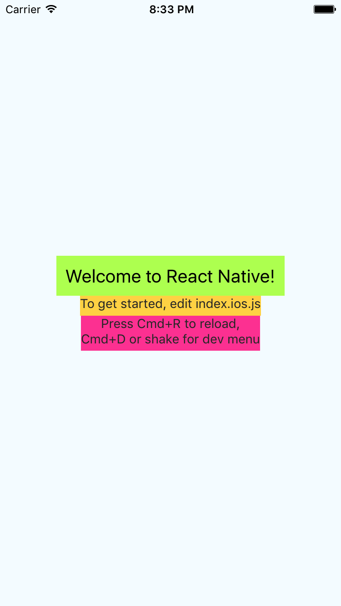
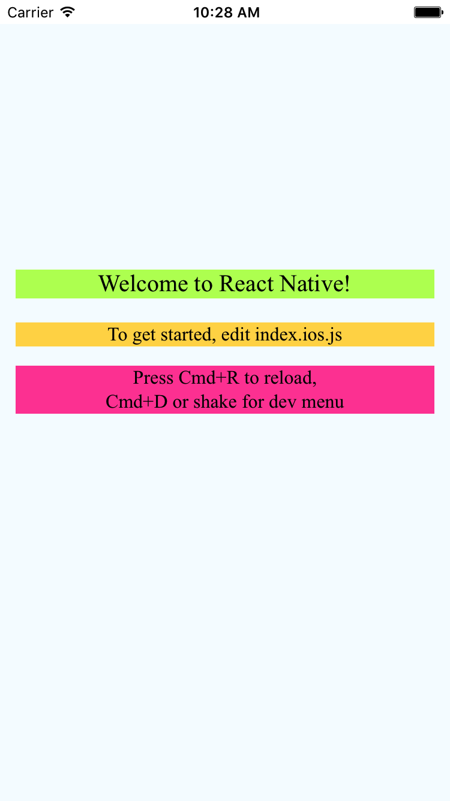
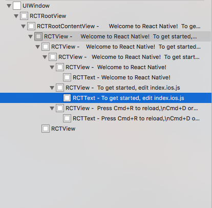
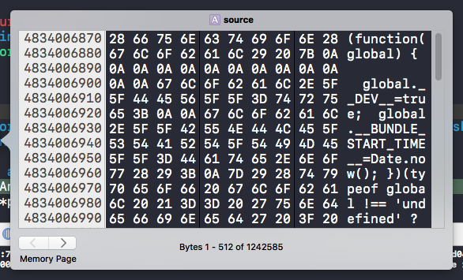
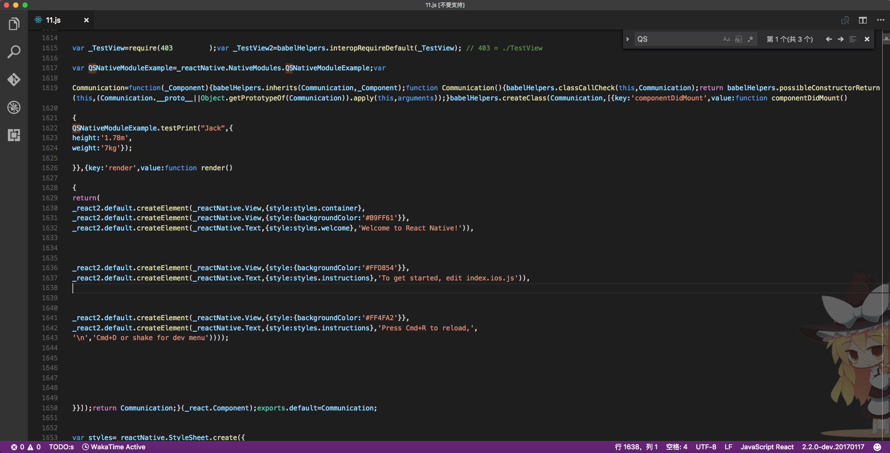

# React Native入门总结

最近三周，从零开始学习当前较为火热的React Native技术，使用RN在iOS平台完成一些小Demo和一个静态的商品详情页。整体来说，对于一个没有任何前端开发经验的Native程序员来，RN的学习曲线还是相当陡峭的。不仅要接触学习RN框架，还要掌握JS的语言特性和相关机制，而JS的编程习惯和一些规范，和此前理解的OO编程思想还是有相当大差异。此外，一项新兴的技术，其相关的参考资料和案例都是很少的。再加上RN的版本也在快速的迭代中，可能仅仅三个月前的Demo，在当前版本就已经不能运行。因此，整个过程中还是踩了相当多的坑。当然，踩得坑多了，还是有些收获的。整体的入门线路分为以下几个方面：   
1. 什么是React Native
2. iOS平台下，React Native是如何工作的
3. 学习JavaScript ES6标准
4. 搭建开发环境以及遇到的环境中的一些坑
5. IDE工作环境配置以及DeBug工具使用
6. 使用RN构建Demo的一些体会

## **1.关于React Native**

首先要了解什么是React Native，以下是官方的介绍：
>React Native enables you to build world-class application experiences on native platforms using a consistent developer experience based on JavaScript and React. The focus of React Native is on developer efficiency across all the platforms you care about - learn once, write anywhere. Facebook uses React Native in multiple production apps and will continue investing in React Native.  

根据官方介绍，React Native的核心同样是基于React框架，并针对Native平台做了相应的适配和封装工作。那什么又是React呢？它同样是Facebook基于Javascript开发的一个前端框架，不同于传统的MVC架构，响应式的机制使它可以更效率的保障大型项目中数据在模型和视图之间的流动。传统的Javascript应用，或者说，传统的MVC架构中，除了界面构建、业务逻辑、数据处理之外，还需要维护大量代码保障模型数据和UI显示的一致。而在React中，则使用一种不同的方案：

>当组件第一次初始化时，`render`方法被调用，为视图生成一个轻量级的表现。通过这个表现，产生一个标签字符串，然后插入到文档中。当数据变化时，`render`方法再次被调用。为了尽可能有效的完成更新，我们比较之前调用`render`返回的值与新的值，然后产生一个最小限度的变更去应用到DOM中。`render`返回的数据既不是一个字符串也不是一个DOM结点。它是一个轻量级的类型，描述DOM应该是什么样的。

可以看到，React中采取一种默认的绑定机制，在数据模型改变时会自动的唤起界面的更新，由此保障数据一致。这和iOS开发中最近几年开始火热的MVVM架构相当类似，使用一层ViewModel链接View和Model，实现数据和UI显示的绑定的效果——当显示界面有事件传递时，ViewModel可以更新Model；反向的，当数据在后台变换后，同样可以通过ViewModel通知UI显示界面更新。  

如果仅仅是引入一种响应式的编程方式，RN推行的解决方案并没有吸引力，它最吸引人的在于集成 Web App 和 Native App 的优点，抛弃缺点。主要体现在以下几个方面：  

#### 1.开发成本  

Native端的开发成本是一个一直被诟病的问题。理论来说，市面上有多少在运行的平台，就需要几个与之对应的Native App。一套相同的流程，进行多次开发，怎么看都是一种浪费。
  

放一张介绍 React 和 RN 的图，可以看到RN继承Web App的优势，只需要一条技术线的学习，便可以开发兼容多端的应用，这也和Facebook官方宣称的`"learn once, write anywhere"`的思想相当吻合。在RN在组件和API设计上，也做到尽量同时兼容多个平台，从当前的更新趋势看，不同平台的组件和API差异都将被慢慢抹去，最终形成一个统一的平台，而不再需要去关注底层的原生平台是什么。

#### 2.用户体验以及性能  

Web App曾经因为开发成本相对低，可以动态更新火过一段时间，之后却又因为，加载速度缓慢，用户交互体验不够良好，过多占用性能等问题冷落下来。RN同样是使用JS这种动态语言实现整个页面的构建，但不同的是，它却是实实在在的原生应用，在JS代码中的各个标签，都会转化为Native的UI组件。  
   


以上两张图分别是RNApp和WebApp的一个简单的Demo展示，为了更好地对比，尽量保证两个Demo内容的统一。先不谈交互，这两个界面都是在用户层面的展示内容，除掉webView的加载进度条，基本是毫无区别的。之后，先看一下RNApp的View Tree和windows的展示：  
   
  
可以看到，RNApp确实与宣称的`真正的原生`是一致的。在界面构建时候，组织多少containor view，最终都会显示在界面上。从整个windows的结构也看到，界面的组织都是使用的RCT开头的原生组件，这些才是在app中真正工作的组件，而不像web一样使用的是HTML元素。  
之后，是WebApp的View Tree和windows：  
   
  
很明显的对比，不管WebApp的界面上展示多少元素，在View Tree中都只有一个WebView的容器，这点从整个windows的结构也可以看到。  
关于加载速度，可能并不能给出详尽的数据，但可以整体感觉到RN的加载速度并没有比原生慢多少，甚至基于JS这种脚本语言的特性，RN还可以做到动态更新，当我更改一处的代码，并不需要重新编译整个APP，而只需要像刷新网页一样刷新一下界面便可看到这些更改。然后说说用户体验，可能经过一系列的优化，WebView的交互体验已经可以不输原生。然而，RNApp中，真正构建App的还是原生组件，可以说，整个RN的交互体验，应该是和原生应用一致的。

#### 3.动态UI和热更新

Native应用的很大一项问题便是每次更新都需要重新发包，在iOS平台甚至需要重新进行审核，所以很多App的活动页面都是使用web构建保障可以在后台进行动态的配置UI界面。而使用RN这种技术，由于JS天然动态性，可以随时下发数据和代码，随时定制UI，相对于Web制作的页面，RN拥有更佳的性能。关于热更新，iOS中用的较多的是JSPatch，都是用来热修复线上的一部分Bug，而很少用来去新增业务功能，而其他的热更新方案都相当复杂，有的甚至需要重启App才生效。但是使用JS语言就不一样，动态语言的一大好处就是可以随时执行，随时替换，使用RN之后，就可以做到随时运行更新JS代码，实现起来比原生的方案简单很多。  
  
简单的说，RN便是移动端的React。使用JS这种动态语言构建Native应用，同时，脱离iOS平台上传统的MVC架构，引入React的MVVM编程思想，集成Native和Web应用的优点，降低开发成本。

## **2.React Native工作原理**

关于开发环境的搭建和各种配置，网上有很多相应的资源，在此不做介绍。这章主要介绍一下RN项目和Native项目的不同，以及RN框架在iOS平台是如何工作的。  
首先使用`react-native init`命令创建一个RN项目，之后从ios文件夹中的xcode项目文件打开工程。整个项目和从xcode中创建的项目相比，少了Main.storyboard，多出很多RCT开头的library，而这些libraries便是RN框架工作的基础，其中React完成OC和JS的通信。  
  

打开App的入口文件AppDelegate.m，看到入口文件只剩一个程序启动完成的方法：

``` objectivec
- (BOOL)application:(UIApplication *)application didFinishLaunchingWithOptions:(NSDictionary *)launchOptions
{
  NSURL *jsCodeLocation;

  jsCodeLocation = [[RCTBundleURLProvider sharedSettings] jsBundleURLForBundleRoot:@"index.ios" fallbackResource:nil];

  RCTRootView *rootView = [[RCTRootView alloc] initWithBundleURL:jsCodeLocation
                                                      moduleName:@"Communication"
                                               initialProperties:nil
                                                   launchOptions:launchOptions];
  rootView.backgroundColor = [[UIColor alloc] initWithRed:1.0f green:1.0f blue:1.0f alpha:1];

  self.window = [[UIWindow alloc] initWithFrame:[UIScreen mainScreen].bounds];
  UIViewController *rootViewController = [UIViewController new];
  rootViewController.view = rootView;
  self.window.rootViewController = rootViewController;
  [self.window makeKeyAndVisible];
  return YES;
}
```
与Native不用的是，多出几个RCT开头的类和其相关方法。首先，从JS端获取iOS的入口文件地址，之后创建一个`RCTRootView`作为整个应用的根视图，创建这个根视图需要几个相关参数，一个是入口文件地址`BundleURL`，一个是初始加载的模块名称`moduleName`,之后是需要传递的参数，最后是应用启动时的一些参数。`moduleName`应该是对应JS文件中的启动模块：  
``` JavaScript
AppRegistry.registerComponent('Communication', () => Communication);
```  
之后设置window的根视图，显示同常规的启动流程。  

因此，整个App的运行环境应该是在`initWithBundleURL:moduleName:initialProperties:launchOptions:`的时候便已经初始化完成。根据调用堆栈，在初始化rootView之前，首先创建一个bridge：
``` objectivec
  RCTBridge *bridge = [[RCTBridge alloc] initWithBundleURL:bundleURL
                                            moduleProvider:nil
                                             launchOptions:launchOptions];
```  

然后进入rootView的init函数，看到这个bridge作为两个通知的监听对象，它是OC和JS之间的桥梁，整个应用的交互都是依赖这个对象。继续追踪bridge的初始化流程，发现在`setup`中创建一个BatchedBridge对象，并执行这个对象的start方法。在这个start函数中，有清晰的官方注释告诉我们这个函数做了哪些工作，包括以下5件事情：
1. 加载资源代码
2. 初始化组件模块
3. 初始化JavaScriptExecutor
4. 生成模块的配置信息
5. 执行JavaScript源码

#### 1.加载资源

除了一些配置信息和队列的创建，第一件事便是加载资源：
```objectivec
  // Asynchronously load source code
  [self loadSource:^(NSError *error, NSData *source, __unused int64_t sourceLength) {
    if (error) {
      RCTLogWarn(@"Failed to load source: %@", error);
      dispatch_async(dispatch_get_main_queue(), ^{
        [weakSelf stopLoadingWithError:error];
      });
    }
```
注释很清晰易懂，这里加载的是资源代码，那到底是什么资源代码呢？包含哪些内容呢？我们设置一个断点，然后看一下显示：
  
可以看到这是一个1.2M的文件，具体内容好像包含很多相关代码，看起来很像JS，但是这么个格式看肯定吐血啊。那么，这时候就可以借助开源的力量，改一下start函数的代码，把这个Data保存到一个文件中，因为看着代码很像JS，我改了JS后缀，配合IDE的着色能更清晰的分析，内容如下：  
  
内容也不多，也就是一个1.2M的JS代码文件，6W多行而已😂  
看来RN框架帮我们生成不少代码，那这些代码到底和我们写的JS代码有多少关系呢？测试的工程是以前写过的一个学习JS调用Native方法和组件的Demo，找出一段JS端的代码：
``` JavaScript
import TestView from './TestView'
var QSNativeModuleExample = NativeModules.QSNativeModuleExample;

export default class Communication extends Component {
  componentDidMount() {
    QSNativeModuleExample.testPrint("Jack", {
      height: '1.78m',
      weight: '7kg'
    });
  }
    render() {
    return (
      <View style={styles.container}>
        <View style={{backgroundColor:'#B9FF61'}}>
          <Text style={styles.welcome}>
            Welcome to React Native!
        </Text>
        </View>
        <View style={{backgroundColor:'#FFD854'}}>
          <Text style={styles.instructions}>
            To get started, edit index.ios.js
        </Text>
        </View>
        <View style={{backgroundColor:'#FF4FA2'}}>
          <Text style={styles.instructions}>
            Press Cmd+R to reload,{'\n'}
            Cmd+D or shake for dev menu
        </Text>
        </View>
      </View>
    );
  }
}
```
然后再生成的文件中搜索`QS`，显示如下：  
  
只有这几十行是我在工程中的编码，剩下的大致看了一下，应该是根据import的内容将对应的库写进文件。

#### 2.初始化组件模块

没有太多值得关注的内容，想要自定义的原生组件与JS交互需要用`RCT_EXPORT_MODULE`宏标记组件，并定义一个组件在JS中的类名，官方定义的组件同样是以这个宏标记，查看这个宏定义：  
```objectivec
#define RCT_EXPORT_MODULE(js_name) \
RCT_EXTERN void RCTRegisterModule(Class); \
+ (NSString *)moduleName { return @#js_name; } \
+ (void)load { RCTRegisterModule(self); }

void RCTRegisterModule(Class moduleClass)
{
  static dispatch_once_t onceToken;
  dispatch_once(&onceToken, ^{
    RCTModuleClasses = [NSMutableArray new];
  });

  RCTAssert([moduleClass conformsToProtocol:@protocol(RCTBridgeModule)],
            @"%@ does not conform to the RCTBridgeModule protocol",
            moduleClass);

  // Register module
  [RCTModuleClasses addObject:moduleClass];
}
```

这个宏返回原生的组件在JS中的名字，然后在load方法中调用注册方法，把这个类加入RCTModuleClasses，之后的事情就是用一个for循环遍历RCTModuleClasses，将其中的所有类都加入配置信息：  

```objectivec
for (Class moduleClass in RCTGetModuleClasses()) {
    NSString *moduleName = RCTBridgeModuleNameForClass(moduleClass);

    RCTModuleData *moduleData = moduleDataByName[moduleName];
    moduleData = [[RCTModuleData alloc] initWithModuleClass:moduleClass
                                                     bridge:self];
    moduleDataByName[moduleName] = moduleData;
    [moduleClassesByID addObject:moduleClass];
    [moduleDataByID addObject:moduleData];

    _moduleDataByID = [moduleDataByID copy];
    _moduleDataByName = [moduleDataByName copy];
    _moduleClassesByID = [moduleClassesByID copy];
  }
```
以上省去部分条件判断代码，但整体的管理模块配置表的逻辑可以看到，便是在Bridge中保存3个数组，分别存储DataID,DataName和ClassID,