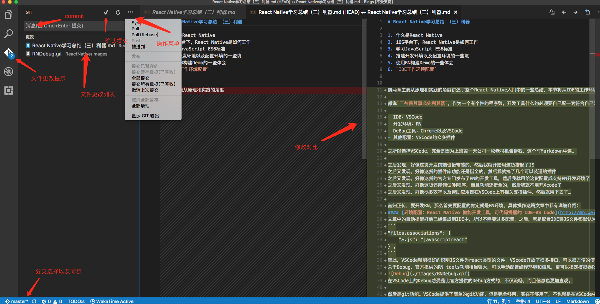

# React Native学习总结 （三）利器  

1. 什么是React Native
2. iOS平台下，React Native是如何工作
3. 学习JavaScript ES6标准
4. 搭建开发环境以及配置环境的一些坑
5. 使用RN构建Demo的一些体会  
6. `IDE工作环境配置`  


前两章主要从原理和实践的角度讲述了整个React Native入门中的一些总结，本节将从IDE的工作环境配置讲述一下如何搭建一个趁手的RN开发环境。  

都说`工欲善其事必先利其器`，作为一个有个性的程序猿，开发工具什么的必须要自己配一套符合自己习惯的。由于之前没有前端的开发经验，对于前端的开发工具并不了解，接触RN之后也是自己摸索出来了一套符合自己习惯的RN开发和调试环境，在此分享一下。  

- IDE：VSCode  
- 开发环境：RN  
- DeBug工具：Chrome以及VSCode  
- 其他配置：VSCode的众多插件  

之所以选择VSCode，完全是因为上班第一天公司一枚老司机告诉我，这个写Markdown牛逼。 

之后发现，好像这货开发前端也挺带感的，然后我就开始用这货撸起了JS  
之后又发现，好像这货的插件库功能还是挺全的，然后我就搞了几个可以装逼的插件  
之后又发现，好像这货的官方专门发布了RN的开发工具，然后我就用给这货配置成支持RN开发环境了  
之后又发现，好像这货还能调试RN程序，而且功能还挺全的，然后我就不用开Xcode了  
之后又发现，好像很多效率以及帮助应用都在VSCode上有相关支持插件，然后就用下去了…  

言归正传，要开发RN，那么首先要配置的肯定就是RN环境，具体操作这篇文章中都有详细介绍：  
#### [环境配置：React Native 智能开发工具，可代码提醒的 IDE—VS Code](http://mp.weixin.qq.com/s?__biz=MjM5NDkxMTgyNw==&mid=2653058224&idx=1&sn=553b4ce24b22680d8f46cba082eb8661&scene=0#wechat_redirect)  
文章中的自动提醒好像已经集成到IDE中，所以不需要过多配置，如果发现没有支持RN的自动补全，可以搜索`VSCode RN开发环境配置`，根据教程调整。之后，就是配置IDE将JS文件都默认为RN文件打开。打开首选项->设置，搜索`files.associations`，并编辑此内容如下：  
```
"files.associations": {
    "*.js": "javascriptreact"
} ,
```  
至此，VSCode就能很好的识别JS文件为react类型的文件。VScode开放了很多接口，可以很方便的使用这些接口配置编译器的属性。  
关于Debug，官方提供的RN tools功能相当强大，可以手动配置编译环境和信息，更可以指定模拟器以及系统的版本，断点调试还提供变量显示，监视功能，调用堆栈以及断点位置，具体不多说，上图：  
  
在VSCode上的Debug感受是比官方提供的Debug方式的，不仅流畅，而且信息也更加直观。  
  
然后是git功能。VSCode提供了简单的git功能，但是完全够用，实在不够用了，不也就是在VSCode中调出终端撸两行命令的事儿吗。具体的git功能继续上图，一图顶千言：  
  

最后是插件，这个东西就很看个人习惯和喜好了，我只列出我当前使用的一部分。  
#### [Auto Rename Tag](https://marketplace.visualstudio.com/items?itemName=formulahendry.auto-rename-tag)  
```
该插件提供了自动匹配对应标签的功能，当你修改一个标签时，另一个标签会自动更改，和`EditAll`功能类似。
```  

#### [background](https://marketplace.visualstudio.com/items?itemName=shalldie.background)  
```
完全是个人喜好…撸代码时候可以配置几张背景图减缓视觉压力，需要根据说明稍微设置一下。  
```

#### [Dash](https://marketplace.visualstudio.com/items?itemName=deerawan.vscode-dash)  
```
Dash就不多介绍了，用过都知道，这个插件的功能是可以实现在VSCode中选中后的一键查询，相当方便。  
```

#### [Document This](https://marketplace.visualstudio.com/items?itemName=joelday.docthis)  
```
一键生成注释  
```

#### [Guides](https://marketplace.visualstudio.com/items?itemName=spywhere.guides)  
```
虽然VSCode中可以格式化代码，但很多时候标签的对其还是很难辨认，老年人眼花就加条线吧。  
```

#### [Path Autocomplete](https://marketplace.visualstudio.com/items?itemName=ionutvmi.path-autocomplete)  
```
自动补全文件路径  
```

#### [Project Manager](https://marketplace.visualstudio.com/items?itemName=alefragnani.project-manager)   
```
管理项目，感觉VSCode的文件打开不够友好，这个可以帮助管理工程  
```

#### [PReact Native Tools](https://marketplace.visualstudio.com/items?itemName=vsmobile.vscode-react-native)    
```
没什么说的，RN开发必要装
```

#### [vscode-icons](https://marketplace.visualstudio.com/items?itemName=robertohuertasm.vscode-icons)   
```
没什么实际卵用，但是安装量已经是百万级别的插件，优化VSCode的图标显示，看着舒服才有心情撸代码…  
```

#### [vscode-todo](https://marketplace.visualstudio.com/items?itemName=MattiasPernhult.vscode-todo)  
```
可以直接列出项目中所有TODO的位置，但是感觉好像有点小Bug，选择语言后会覆盖RN的智能提醒  
```

#### [WakaTime](https://marketplace.visualstudio.com/items?itemName=WakaTime.vscode-wakatime)   
```
个人使用的一款工作记录软件，有兴趣的可以了解一下WakaTime  
```

#### **各式各样的补全以及语言支持插件**  
```
这个就要根据个人的开发自行搜索了  
```

最后，帖上一篇介绍VSCode的配置和快捷键的文章：  
#### [Visual Studio Code 配置指南](https://github.com/kaiye/kaiye.github.com/issues/14)   

更多插件以及功能还有待发掘，欢迎讨论共享…

  

## 相关链接
[ReactNative学习总结（一）原理](./ReactNative学习总结（一）原理.md)

