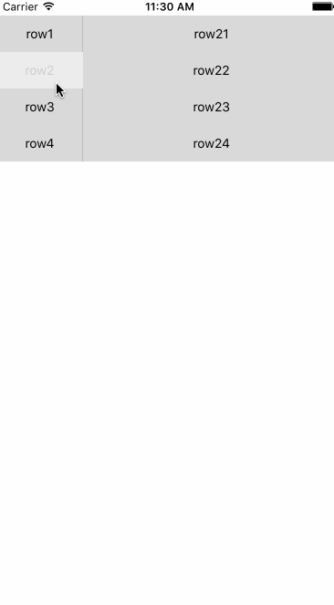

# Redux 初探  

### 为什么要使用 Redux

近些年，React的火热可以看到响应式的UI构建方案已经逐渐成为当前的主流；然而，在火热的同时，React的局限性也渐渐凸显。最初的React便是为了UI的构建而生，忽略了以下两个方面：  

>- 代码结构  
>- 组件之间的通信  

当然，我觉得最头痛的应该是不同组件间的状态管理以及组件间的通讯。例如，需要在一个ListView中实现一个单选操作，如果将所有的选择内容封装到一个Cell中的组件中，需要如下操作：  

1. 在父组件中创建一个记录当前选择index的state

```JavaScript
export default class Details extends Component {
  constructor(props) {
    super(props);
    this.state = {
      chooseIndex: -1,
    }
  }

  _chooiseNewType = (index) => {
    console.log('点击了' + index);
    this.setState({ chooseIndex: parseInt(index) });
  }
```  

2. 在父组件中实现一个点选修改index的方法

```JavaScript
  _chooiseNewType = (index) => {
    this.setState({ chooseIndex: parseInt(index) });
  }
```  

3. 在创建子组件时，将该方法和当前的index传递到子组件  

```JavaScript
<QuantitySelectCell 
            arr={rows} 
            chooiseNew={this._chooiseNewType} 
            index={this.state.chooseIndex} />

```  

4. 在子组件中同样需要一个管理index的state  

```JavaScript
export class QuantitySelectCell extends Component {
  constructor(props) {
    super(props);
    this.state = {
      currentIndex: -1,
    };
  }
}
```  

5. 在子组件中同样需要一个响应点击事件的函数

```JavaScript
_selectedNewBox = (index) => {

    //防止反复回调
    if (index === this.state.currentIndex) {
      this.setState({ currentIndex: -1 });
      return;
    }

    this.setState({ currentIndex: index });
    //回调新的选择项
    if (this.props.chooiseNew) {
      this.props.chooiseNew(index);
    }
  }
```   

6. 将最终的展示状态传递给显示组件  

```JavaScript
<QuantityItemView
        key={index}
        index={index}
        selected={this.state.currentIndex === index ? true : false}
        title={item.title}
        disable={item.disable}
        click={this._selectedNewBox} />
```  

7. 最终，在显示组件中完成整个点击事件的处理操作，以及对父组件状态的更新  

```JavaScript
<TouchableOpacity style={styles.buttonStyle} disabled={this.props.disable} onPress={() => {
    if (this.props.click) {
      this.props.click(this.props.index);
    }
  }} />
```  

至此，一个单选的数据即可以完整的在父组件中更新。可以想到，在四层、五层甚至六层的组件中，这个回调将更加的繁琐与复杂，虽然可以通过良好的设计避免多层的回调，但是这种方案依然是相当的繁琐与复杂，多层的state管理起来相当繁琐，一不小心就可能会在某一层的回调中出现问题或者state设置错误。  

另一种方案便是将不同的选择项放在不同的Cell中，这样便涉及到了不同组件间的通信。由于React开发经验的不足以及在不同Cell间的单选涉及到了this的传递以及循环引用等问题，最终我也没能实现此种方案的单选。可以预见到的，即使可以实现，这种方案依然涉及到不同组件的state的管理以及多层的回调的问题。  

这些都是React存在的问题，可能存在一些高级的编程技巧可以规避此类问题，但对于我一个初学者来说，这样的坑必然需要寻找一种合适的解决方案，那么这个解决方案便是Redux。

### Redux 简介  

Redux的各种简介在此不赘述，我们只需要关注它的核心作用在哪：  

>- 单一数据源
>- State 是只读的
>- 使用纯函数来执行修改  

以上三条是Redux的核心原则，每一项都是针对React现存的问题。`单一数据源`即整个应用的 state 被储存在一棵 object tree 中，并且这个 object tree 只存在于唯一一个 store 中。这样便保障整个应用只存在一个state，这让同构应用变得清晰渐变了很多；`State 是只读的`即只有触发action方法可以改变state，而action对象则是整个业务中的一个可以遇见的流程。这样确保了视图和网络请求都不能直接修改 state，相反它们只能表达想要修改的意图。因为所有的修改都被集中化处理，且严格按照一个接一个的顺序执行，因此不用担心 race condition 的出现。 Action 就是普通对象而已，因此它们可以被日志打印、序列化、储存、后期调试或测试时回放出来。`使用纯函数来执行修改`则是要编写reduce描述action改变state的流程逻辑。虽然每个reduce可能对应一个相应的页面，但是由于每个reduce都是纯函数，这样便可以任意的控制任意的调用顺序，而不用考虑上下文的业务逻辑。  

在React-Redux中，还需要注意的是，组件被划分为两类，分别是 component 和 container 。  

component 也称为 UI 组件，只负责显示，而不带有其他的功能，没有自身的 state 的，所有的数据以及展示逻辑都由 Props 提供。container 组件则刚好相反，它不负责任何和展示相关的内容，使 Redux 的 API 管理内部状态以及业务逻辑。所有的 component 组件需要我们自己构建，而 container 则是通过一些映射关系在 UI 组件的基础上进行生成，我们并不需要关心整个生成的过程，而只需要提供 action 的分发以及 state 到 props 的映射即可。

### Redux 使用  

首先是安装redux，使用如下命令：  

>npm install --save redux  

如果要在react中使用redux则还需要安装另外几个库： 

>npm install --save react-redux  
>npm install --save redux-thunk  
>npm install --save-dev redux-devtools  

react-redux的使用同样是围绕核心的三个原则展开的，以下先使用一个简单的加减器展示整个流程。 

1. 定义Action以及Type  

Action 是把数据从应用传到 store 的有效载荷。它是 store 数据的唯一来源，从 action 到 store 的数据分发使用 dispatch() 完成。此外，在 action 中还要定义一个 Type 表示将要执行的动作，通常 Type 使用字符串常量。创建Type和Action：  

```JavaScript
// Action Creator
const INREASE = 'INREASE';
const SUBTRACT = 'SUBTRACT';
const increaseAction = { type: INREASE }
const subtractAction = { type: SUBTRACT }
```  

由于加减操作仅需操作全局state中的count做加减操作，因此不需要传入额外参数，如果需要传入额外参数，则可以像如下定义：  
```JavaScript
export const SELECTROW = "SELECTROW";

export function selectedRow (index) {
    return {
        type:SELECTROW,
        index,
    }
}
```  

2. 创建 reduce 并完成 action 到 reduce 的映射  

Action 只是描述了有事情发生了这一事实，并没有指明应用如何更新 state。而这正是 reducer 要做的事情。创建一个 reduce：  

```JavaScript
// Reducer
function counter(state = { count: 0 }, action) {
  const count = state.count
  switch (action.type) {
    case INREASE:
      return { count: count + 1 }
    case SUBTRACT:
      return { count: count - 1 }
    default:
      return state
  }
}
```  
这样，在每次分发 action 后， reduce 就能做相应的处理并返回更新后的数据。  

3. 生成 container  

上一节介绍过， redux 框架下的组件分为 UI 组件以及 container 组件，在完成 UI 组件后，需要一个映射关系生成相应的 container 组件： 

```JavaScript
function mapStateToProps(state) {
  return {
    value: state.count
  }
}

function mapDispatchToProps(dispatch) {
  return {
    onIncreaseClick: () => dispatch(increaseAction),
    onSubtractClick: () => dispatch(subtractAction)
  }
}

const App = connect(
  mapStateToProps,
  mapDispatchToProps
)(Counter) 
```  

mapStateToProps 负责将全局的 state 数据映射到该组件的 props 上， mapDispatchToProps 负责映射页面的响应逻辑到 action 。

以下是 UI 组件代码：  

```JavaScript
class Counter extends Component {
  render() {
    const { value, onIncreaseClick,onSubtractClick } = this.props
    return (
      <View>
        <Text>{value}</Text>
        <TouchableOpacity onPress={onIncreaseClick}>
          <Text>Increase</Text>
        </TouchableOpacity>
        <TouchableOpacity onPress={onSubtractClick}>
          <Text>Subtract</Text>
        </TouchableOpacity>
      </View>
    )
  }
}
```  

4. 创建 store 以及获取全局的 store  

全局只能拥有一个 store 管理 state ， store 数据的管理使用 reduce ，当有多个 reduce 时，需要将多个 reduce 合并成一个 reduce 然后再创建一个统一的 store ，而不是为每个 reduce 创建对应的 store 。此外，需要使用 Provider 组件获取全局的 store 。组织代码如下：  

```JavaScript
const store = createStore(counter)

export default class ReduxTest extends Component {
  render() {
    return (
      <Provider store={store}>
        <View style={styles.container}>
          <App />
        </View>
      </Provider>
    );
  }
}
```  

至此，便是 react-redux 使用的基本流程，具体效果如下图：  

  

Demo源码可以点击[这里]()。  

### Redux 实践  

初学 Redux 以及看了 Counter 的代码后，并没有觉得 Redux 相对于 react 的实现方案有多少的优势，反而觉得在整个流程上相当繁琐——首先要定义 ActionType ；之后要对整个应用的业务逻辑有一个清晰的认知才能定义好 Action ；然后，还要定义好各个组件的 reduce ，并将其实现为纯函数；接着，实现好映射，生成 container ；最后，生成全局的 store 。  

刚接触时候，我也被以上的各种流程绕来绕去云里雾里，觉得这是一个很复杂的使用流程，还不如使用正常的逻辑回调，这也是为什么很多介绍 redux 的文章在开篇都会放上一片[《You Might Not Need Redux》](https://medium.com/@dan_abramov/you-might-not-need-redux-be46360cf367#.7cq7nr1z2)的原因。直到我实现单选功能时候，遇到各种难以解决的问题时候，使用了 redux 才发现，这个解决方案在复杂的业务流程中的能量。  

以下，将从一个双列表的实现分析 redux 在复杂业务流程的作用，具体的源码可以点击[这里]()。  

首先上张效果图:  

  

根据 redux 的流程，首先是创建 Action 以及 Type：  

```JavaScript
export const SELECTROW = "SELECTROW";

export function selectedRow (index) {
    return {
        type:SELECTROW,
        index,
    }
}
```  

然后是创建 reduce：  

```JavaScript
export function select(state = { index: 0 }, action) {
  switch (action.type) {
    case Type.SELECTROW:
      return { index: action.index }
    default:
      return state
  }
}
```   

再之后是生成 container 组件：  

```JavaScript
function mapStateToProps(state) {
    return {
        selectedID: state.index
    }
}

function mapDispatchToProps(dispatch) {
    return {
        selectRowAtIndex: (index) => {
            dispatch(selectedRow(index));
        }
    }
}

const MyCell = connect(
    mapStateToProps,
    mapDispatchToProps
)(RowCell)
```  

因为双列表，在点击左端列表时，需要更新右侧列表，因此还需要对列表组件进行包装：  

```JavaScript
function mapStateToProps(state) {
    return ({
        selectIndex: state.index,
    })
}

export default connect(mapStateToProps)(App);
```  

最后，生成全局的 store ：  

```JavaScript
var store = createStore(select);

return (
  <Provider store={store}>
    <App dataArr={arr} />
  </Provider>
);
```   

UI 组件的代码在这里就不贴出来了，具体可以去源码中参考。至此，就看一看出 redux 在回调流程上的简便之处，不需要去逐层的更新父组件的 state 数据，而只需要通过分发的 action 改变全局的 state 便可，在将数据传递给 UI 组件时，也仅仅需要一个映射，具体的操作 redux 都会在底层帮我们完成。避免了多层回调，统一管理了 state ，这是我目前看来 redux 最大的作用。  

### 参考
[Redux 中文文档](http://www.redux.org.cn/docs/basics/Reducers.html)  

[You Might Not Need Redux](https://medium.com/@dan_abramov/you-might-not-need-redux-be46360cf367#.7cq7nr1z2)  

[Redux 入门教程（一）：基本用法](http://www.ruanyifeng.com/blog/2016/09/redux_tutorial_part_one_basic_usages.html)  

[Redux 入门教程（二）：中间件与异步操作](http://www.ruanyifeng.com/blog/2016/09/redux_tutorial_part_two_async_operations.html)  

[Redux 入门教程（三）：React-Redux 的用法](http://www.ruanyifeng.com/blog/2016/09/redux_tutorial_part_three_react-redux.html)  
