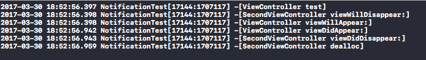
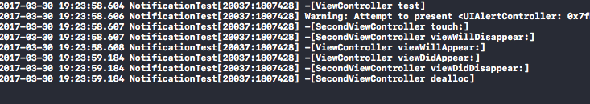
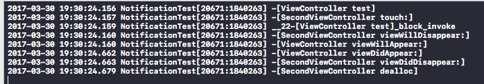

# NSNotificationCenter的一些坑点

下午做了一个跟通知相关的功能，内容很简单：目前，有A、B两个控制器，分别都有一个按钮，A上面的按钮是用来跳转到B的，B上面的按钮是用来返回A，并在A上面提供一个Alert，弹窗的这个操作使用通知实现。具体的代码如下：  

A Controller:  
```objc
@implementation ViewController

- (void)viewDidLoad {
    [super viewDidLoad];
    [[NSNotificationCenter defaultCenter] addObserver:self selector:@selector(test) name:@"test" object:nil];
}

- (void)test {
    [Utils showAlertViewWithController:self title:@"提示" message:@"这是一个测试" confirmButton:nil];
}

- (void)dealloc {
    [[NSNotificationCenter defaultCenter] removeObserver:self name:@"test" object:nil];
}

@end
```   

B Controller:  
```objc
@implementation SecondViewController

- (void)viewDidLoad {
    [super viewDidLoad];
}

- (IBAction)touch:(id)sender {
    [[NSNotificationCenter defaultCenter] postNotificationName:@"test" object:nil];
    [self dismissViewControllerAnimated:YES completion:nil];
}

@end
```  

代码也很简单，但是却在弹窗的时候出了问题，当业务逻辑按照以上代码运行的时候，返回A界面后，并没有弹窗出现，在Log界面也会有以下输出：  

>Warning: Attempt to present <UIAlertController: 0x7fdc0821e410> on <ViewController: 0x7fdc05d08880> whose view is not in the window hierarchy!  

意思就是在present的时候，A界面并没有出现。  

因为在返回的时候，是不会走`viewDidLoad`方法的，因此，我尝试了在`viewWillAppear`方法中加载弹窗，发现是没有问题的，说明在`viewWillAppear`时，A已经加载到window上了。为了进一步验证具体在哪些地方出现了问题，我将A、B的所有生命周期方法都重写，看看在从B到A的过程中，所有函数的调用顺序。在从B到A的过程，调用顺序如下：  

  

弹窗的操作在所有操作的最前面，这样看，可能还真是因为在A还没有加载出来的时候，弹窗操作就已经执行了。分析到此，就要开始解决问题了，方法可能有许多：什么开线程监听A出现后再弹窗，什么添加标志位在A的生命周期的某一位置再弹窗，什么设置延时操作等……这些都是可行的解决方案，但是理论来说，一个简单的通知回调，不应该需要太多的额外错做才对，不然苹果不会废弃了UIAlertView这种window界别的弹窗而改用界面级别的弹窗。因此，我尝试修改了一下B中通知发送和界面消失的顺序：  

```objc
- (IBAction)touch:(id)sender {
    [self dismissViewControllerAnimated:YES completion:nil];
    [[NSNotificationCenter defaultCenter] postNotificationName:@"test" object:nil];
}
```  

之所以这么改，也是基于刚才的打印结果分析无法弹窗的原因是A还没有出现，B还没完全消失，那我们就修改成先消失，再发通知，结果是这个方案果然奏效，这么说，分析结果应该没有问题，然后我又追踪了整个dismiss过程的输出顺序，奇怪的是，和修改代码之前并没有区别。那这就只能说明，dismiss过程和通知的执行时间在我们追踪范围之外，但通知的操作应该是从执行那一刻开始，就已经在其他线程执行了。这很容易验证，我在未调整顺序的代码的Touch的最后一行添加输出：  

```objc
- (IBAction)touch:(id)sender {
    [[NSNotificationCenter defaultCenter] postNotificationName:@"test" object:nil];
    [self dismissViewControllerAnimated:YES completion:nil];
    NSLog(@"%s",__func__);
}
```  

打印结果和预期一样：  

  

我首先点击的按钮，而test方法却在touch方法之前执行，验证了通知是在发出那一刻便已经执行了，那调整顺序程序正常运行也可以解释的通——通知发出去的那一刻执行了弹窗，而这时，dismiss方法还没有执行，找不到A也是正常的情况，只有在B消失后，A才会出现，调整顺序刚好达到了这个目的。  

分析了正常的解决方法，在解决的过程中，我还发现了一个问题。前面也说了，设置一个延时便可以解决这个问题，但是延时设计为多少呢？设计长了肯定体验不好，短了又不能确保正确显示。但在最终的调试中我发现，这个时长不管设置多短，程序都可以正常执行，只要你设置了延时。代码如下：  

```objc
- (void)test {
    dispatch_after(dispatch_time(DISPATCH_TIME_NOW, (int64_t)(0 * NSEC_PER_USEC)), dispatch_get_main_queue(), ^{
        [Utils showAlertViewWithController:self title:@"提示" message:@"这是一个测试" confirmButton:nil];
    });
}
```   

可以看到，我把延时设成了0，而且为了避免计算机0不准确的问题，我把单位也设成了很小的纳秒，最终程序还是可以正常执行。在touch中先发通知，再执行dismiss操作，在test中设置2个输出，一个在block外，一个在block内，继续追踪调用堆栈，显示如下：  

  

不论执行了多少次程序，block的调用都会在touch之后，这说明了弹窗的操作是在dismiss后进行的，所以程序的运行正常，至于为什么，因为对GCD的具体实现没有深入的研究，目前还是没有什么思路，欢迎一起讨论。

[Demo链接](https://github.com/zj-insist/iOS-Test-Demos/tree/master/Test-Demos/Notification)
