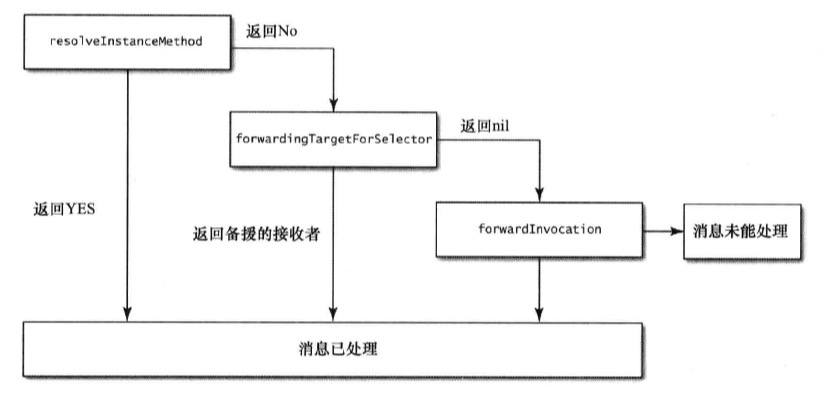
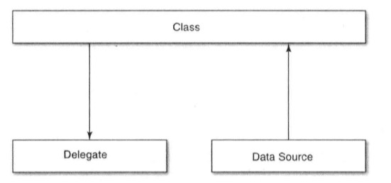

# 《Effective Objective-C 2.0》读书笔记  

## Objective-C 基础

### 1. 尽可能不在头文件中引入其他头文件  

- 编译其间，头文件并不关心引入文件的内部实现，此时可以使用 `@class someClass` 的`向前声明`的方式通过编译。因为引入头文件后编译器就会把相应的头文件复制到引用的文件内，而向前声明的方式省略了这一步，可以减少部分编译时间；此外，这种方式也可以有效避免两个文件的循环引用导致编译不通过，以及文件间的耦合。  

- 在引入的头文件中包含协议等内容必须要引入时，最好的做法是声明一个引入协议这个类的category，然后再在这个category引入头文件，这么做的意义是为了降低彼此的依赖关系（书中表示还可以缩短编译时间，暂时没有理解）。个人理解是，这种方案遵循`只在使用时引用的原则`，因为协议肯定要搭配实现的代理方法使用，声明category用于统一管理代理方法，只有这个代理需要这个协议的声明，这样就降低了category原有类和协议之间的依赖。如果不偏向这种设计，还可以将协议单独放到一个头文件，要引用的时候导入。
 

### 2. 尽可能多的使用字面量语法创建OC对象  

- 多使用如下中字面量的方式代替方法的方式创建OC对象，这样做的目的是可以让代码简洁，字面量的方式也不过是OC的语法糖，方便创建对象的一种写法，实际还是需要调用方法，用这种方式创建时，如果对象中包含nil会直接报错，方便定位，当然，不便之处在于不可变类型的对象不能用这种方式创建，解决方式也很简单，拷贝一份此类对象的可变副本即可

    ```objc
        //字面量
        NSString *strValue = @"我是一个字符串";
        //方法创建
        NSString *strMethod = [NSString stringWithFormat:@"我也是一个字符串"];
        //字面量
        NSNumber *numValue = @1;
        //方法创建
        NSNumber *numMethod = [NSNumber numberWithInteger:1];
        //字面量
        NSArray *arrValue = @[@"1",@"2"];
        //方法创建
        NSArray *arrMethod = [NSArray arrayWithObjects:@"1", @"2", nil];
        //字面量
        
        NSDictionary *dicValue = @{@"key1":@"value1",
                                @"key2":@"value2"};  
        //方法创建
        NSDictionary *dicMethod = [NSDictionary dictionaryWithObjectsAndKeys:@"value1", @"key1", @"value2", @"key2", nil];
    ```   

- 多使用下标的方式访问数组或者字典，原理和对象的创建一样，可以让代码看起来更简单易懂，而不是包含大量方法名   

### 3. 多用常量代替预处理指令#define  

- #define只是一个简单的替换处理，而常量可以显示比如类型等更多的信息，而且使用const关键字可以防止使用过程中被修改  

- 使用`static type const`修饰编译单元内的常量，定义在编译单元的实现文件中，常量命名使用k作为前缀，使用这种方式定义的常量和#define定义的常量类似，但是只在编译单元内做替换工作，优势是包含类型信息  

- 使用`extern type const`修饰全局常量，命名使用类前缀作为修饰避免命名冲突，在头文件中声明常量，并在实现文件中给出常量的值  

### 4. 使用枚举表示状态相关内容  

- 使用枚举代替int、string等值代表的状态码，可以让程序更加通俗易懂，此外应该尽量使用系统定义的NS_ENUM类型或者NS_OPTION宏定义来定义枚举，这样可以自己定义枚举的类型  

- 在使用switch处理枚举时，不实现default分支。这样在我们新加入状态后，编译器会有警告信息，以便定位以及调整switch  

## 对象、消息、运行时

### 5. 在对象内部尽量直接访问实例变量  

- 通过实例变量访问不会调用setter和getter方法，不经过消息转发，拥有更高的效率  

- 设置值时，使用属性会调用setter方法，这样可以跟踪属性设置的流向和进行断点调试  

- 实例变量的访问方式不调用KVO  

- 使用属性设置值时需要注意，如果在子类中重写了setter方法，子类的初始化其实会调用重写的setter方法  

- 使用属性的访问方式更便于懒加载的实现  

- 属性和实例变量的方式选择要根据实际情况确定，主要的考虑因素是对象的访问需不需要经过setter或者geter方法，需要则使用属性，不需要则使用实例变量，一般在对象的初始化和dealloc方法中，总是应该使用实例变量读写数据  


### 6. “对象等同性”概念  

- 对象的对等，使用 `==` 对比的是两个对象的指针是否相当，结果并不一定是正确的结果，比如对比通过不同方式初始化的两个内容相等的字符串， `==` 的结果是不同的，而我们一般会期望相同。判断两个对象的对等关系，一般需要使用 `NSObject` 类中的 "`isEqual`" 方法对比  

- `NSObject` 协议用于判断对象相等的是以下两个方法：  

    ```objC
        - (BOOL)isEqual:(id)object;
        - (NSUInteger)hash;
    ```   
    两个方法的默认实现都是当且仅当内存地址相同时才返回两个对象相等。对象遵守 `NSObject` 协议我们便可以根据自己的需求实现判断两个对象对等的规则。比如，两个对象的属性都对等时我们便认为两个对象相等，而不需要两个对象的指针相同。以下是一个简单的实现：  

    ```objC   
        //.h
        @interface Person : NSObject   
        @property(nonatomic, copy) NSString *firstName;
        @property(nonatomic, copy) NSString *lastName;
        @property(nonatomic, assign) NSInteger age;
        @end
        
        //.m
        @implementation Person
        //isEqual
        - (BOOL)isEqual:(id)object {
        if (self == object) return YES;
        if ([self class] != [object class]) return NO;
        
        Person *tempPerson = (Person *)object;
        if (tempPerson.firstName != _firstName) return NO;
        if (tempPerson.lastName != _lastName) return NO;
        if (tempPerson.age != _age) return NO;
        return YES;
        }

        //hash
        - (NSUInteger)hash {
            return [_firstName hash] ^ [_lastName hash] ^ _age;
        }

        @end

    ```   

    `hash` 函数可以有很多种实现，甚至可以返回一个固定的值，它对两个对象相当的判断只起到一个辅助作用，相等的对象一定返回相同的 hash 值，而 hash 值相同的对象却不一定相等。其主要作用是在对象被添加到集合时，可以有较高的存取效率，如果返回一个固定的值，操作容器中的对象则每次都要去遍历整个碰撞后的链表，效率极其低下。所以，实现 hash 函数需要寻求一个碰撞少的算法，而 hash 值的生成也应该简单高效。  

- 如果需要频繁的调用对等性的判断，还是建议自己创建对等性方法而不是重写 `isEqual` 方法，一方面是减少了类型判断提升效率，一方面又能保障代码逻辑和结构的清晰  

- 集合类型也有等价判断方法，`isEqualToArray`, `isEqualToDictionary` 分别对应数组和字典的想等下判断，方法默认会首先判断对应位置的对象是否相等，如果相等，则调用 `isEqual` 判断两个对象是否相等，知道判断所有位置的对象相等才会返回两个集合相等。集合的相等涉及同等性深度的一个问题，如果判断两个集合并不需要所有位置的对象都完全相等，则可以自定义对等方法判断来提高对等性判断的效率   

- 如果可变类型对象添加入容器则可能导致修改后的对象被放入"`错误`"的位置，比如在一个 NSSet 中添加两个可变数组，之后再改变一个数组和另一个数组相同，这样 NSSet 中就出现了两个相同的元素，这很明显是不合理的，因此在添加可变对象到容器中时要格外小心，另一方面，对象添加入容器是根据 `hash` 值决定位置的，所以，生成 `hash` 值时应尽量使用不可变部分  

### 7. 类簇  

- 使用类簇配合工厂方法可以把各种个性化的实现细节隐藏到一系列公共接口之后  

- 类簇中某一个子类对象的实例的类型和类簇的类型是不一样的  

### 8. 关联对象  

- 可以使用运行时的关联相关方法，在运行时给一个对象动态的绑定属性相应的记录信息已达到某些情况下代码更加聚合的目的  

- 关联对象方法需要慎用，因为相关方法是在运行时添加的，很难通过常规的 DeBug 手段发现出现的问题  

### 9. 关于 obj_msgSend  

- 理解OC与C之类静态语言的区别主要是理解动态绑定和静态绑定的区别，简单理解是程序执行过程中需要调用的函数是在编译器就已经决定了的还是运行过程中才能决定   

- obj_msgSend 会维护一个快速访问方法列表，每次有方法调用都会更新这个列表保障方法的检索速度  

- 在一些边界情况下，OC运行环境会调用一下函数做特殊处理：  

    - obj_msgSend_stret: 处理调用函数返回结构体的问题  
    - obj_msgSend_fpret: 处理调用函数返回浮点数的情况，因为在不同架构的CPU上，浮点数存在差异  
    - obj_msgSendSuper: 处理发送给超类的消息  

- obj_msgSend 使用"`尾调用优化`"的技术使调用函数的跳转变得更简单  

### 10. 消息转发  

- OC 作为一门动态语言，在对象接受了一个一无法解读的消息时，并不会直接报错而是进入消息转发流程，消息转发分为以下两个阶段，只有以下两个阶段都没有正常处理消息时，才会报错：  

    - 动态方法解析：  

        很多文章提到在对象接收到一个未知消息时会有两次拯救机会，动态方法解析便是第一次，未知消息会流向 "`+ (BOOL)resolveInstanceMethod:(SEL)sel`" 方法，对应类方法的还有 "`+ (BOOL)resolveClassMethod:(SEL)sel`" 方法。在消息流向这两个函数时，如果在函数内部实现了对未知消息的处理，消息便可以被正常处理   

    - 备选接收者：  

        在动态方法解析失败后，第一阶段还有最后一次拯救这个消息的机会， "`- (id)forwardingTargetForSelector:(SEL)aSelector`" 方法可以让当前消息接收者选择一个转发对象，让这个对象处理这个消息。`OC 中没有多重继承的机制，但是使用这个方法便可让一个对象内部处理多种类型的消息，对外表现和多重继承类似`  

    - 完整消息转发：  

        系统会创建一个 NSInvocation 对象，封装消息包含的所有信息和细节，最后进入最终的转发阶段，流入 "`- (void)forwardInvocation:(NSInvocation *)anInvocation`" 方法，该方法与备选接收者实现基本一致，负责把消息转发出去，因为已经经过了备选接收者阶段，因此这一步不能仅仅是简单的转发，而是需要触发消息前对消息进行部分调整，如改变参数或者选择子。如果在当前类无法处理则会调用父类的方法处理，直到 NSObject。当消息流入 NSObject 类，说明这个消息时无法处理的消息，最终会调用 "`- (void)doesNotRecognizeSelector:(SEL)aSelector`" 抛出异常结束整个消息转发过程  

- 以下是整个消息转发的流程图：  

      

    消息在每一步都可能会被处理，但是越往后处理的代价越大，需要处理的内容也越多，因此如果可以应该在尽可能早的处理消息  

    消息转发可以参考 [Demo](https://github.com/zj-insist/EffectiveObjCDemo) 项目 `EOCAutoDictionary` 中的内容  

### 11 .方法调和(Method Swizzing)  

- 可以再运行时对不了解实现细则的现有方法进行扩展，最通常的用法是为现有方法添加日志打印功能，也可对基类的某些子类调用达到让子类个性化的作用  

- 不要滥用 Method Swizzing。Method Swizzing 可以在任意时刻调用，如果产生问题将难以追踪  

### 12. 理解 “类对象”  

- OC 中，一个类拥有如下结构：  

    ```objc
        struct objc_class {
            Class isa  OBJC_ISA_AVAILABILITY;
        #if !__OBJC2__
            Class super_class                       OBJC2_UNAVAILABLE;  // 父类
            const char *name                        OBJC2_UNAVAILABLE;  // 类名
            long version                            OBJC2_UNAVAILABLE;  // 类的版本信息，默认为0
            long info                               OBJC2_UNAVAILABLE;  // 类信息，供运行期使用的一些位标识
            long instance_size                      OBJC2_UNAVAILABLE;  // 该类的实例变量大小
            struct objc_ivar_list *ivars            OBJC2_UNAVAILABLE;  // 该类的成员变量链表
            struct objc_method_list **methodLists   OBJC2_UNAVAILABLE;  // 方法定义的链表
            struct objc_cache *cache                OBJC2_UNAVAILABLE;  // 方法缓存
            struct objc_protocol_list *protocols    OBJC2_UNAVAILABLE;  // 协议链表
        #endif
        } OBJC2_UNAVAILABLE;
    ```   

    还需根据类的结构理解如下这张图：  

       

    OC 中关于类的内容比较多，可以在网上搜索相关概念   

## 接口与 API 设计   

### 13. 使用前缀避免命名冲突  

- 使用前缀避免命名空间冲突， Apple 宣称保留所有两个字母前缀的权利，因此根据规范，我们应该至少使用三个字母的前缀来避免命名空间冲突  

- 理论来说，不仅仅是类，类中的方法也应该添加相应前缀，因为实现文件中所有的纯C函数以及全局变量都会被认为是顶级符号，如果别的文件再声明相同名称的方法，就会出来问题  

- 实现一个第三方库时要格外小心引入其他第三方库，即便要引入也要将这个第三方库的所有命名加上当前实现的第三方库的前缀，不然使用者在引入这个第三方库和这个第三方库中引入的库时，就会出现命名问题  

### 14. 指定初始化方法  

- 一个类可以有数个初始化实例的方法，但是应该至少有一个是“`指定初始化方法`”，这个方法要包含初始化所需要的所有必要信息，而其他的初始化方法应尽量是调用“`指定初始方法`”完成初始化，这样有一个统一入口，如果需要对初始方法做一些修改，只用修改很少代码  

- 子类的“`指定初始化方法`”应该也尽量调用父类的“`指定初始化方法`”，必要的情况下，子类需要重写父类的“`指定初始化方法`”达到即使子类调用父类初始化方法，初始化后的对象也是满足子类需求，或者在子类调用父类初始化方法时直接抛出异常    

- 特定情况下，需要不止一个“`指定初始化方法`”   

- “`指定初始化方法`”还有很多需要注意的内容，具体可以参考[这里](http://www.cnblogs.com/smileEvday/p/designated_initializer.html)，相关实例代码，可以参考 [Demo](https://github.com/zj-insist/EffectiveObjCDemo) 项目`Designated` 中的内容   

### 15. 尽量使用不可变对象  

- 在声明对象的属性时，对于不会被修改的属性，应尽量使用 `readnoly` ，这样可以避免一些未知问题  

- 如果某对象只可对对象内部修改，则应该在其分类中将 `readnoly` 扩展为 `readwrite`  

- 尽量不要把可变类型的容器在属性中公开，而是开放一系列修改这个属性的方法  

### 16. 为私有方法名添加前缀  

- 为私有方法添加前缀用于区分私有方法和公共 API ，由于公共 API 不能随意更改，使用前缀区分便可了解哪些方法名是可以变动的  

- 避免使用单一下划线作为私有方法前缀， Apple 框架中的私有方法以单一下划线开头，如果使用单一下划线可能会出现覆盖父类私有方法的问题  

### 17. NSCopying 协议  

- 如果想要自定义的类支持 copy 功能，则需遵从 NSCopying 协议并实现 `- (id)copyWithZone:(nullable NSZone *)zone` 方法，同理 MutableCopying 则需要实现 `- (id)mutableCopyWithZone:(nullable NSZone *)zone` 方法，以下是一个简略的实现：  

    ```objc
        - (id)copyWithZone:(NSZone *)zone {
            Person *newPerson = [[self class] allocWithZone:zone];
            newPerson.lastName = [_lastName copy];
            newPerson.firstName = [_firstName copy];
            newPerson.age = _age;
            
            return newPerson;
        }
    ```  

- copy 返回的是不可变对象的拷贝， mutableCopy 返回的是可变对象的拷贝  

- 对于容器类型，需要额外注意深拷贝和浅拷贝的问题，系统的方法一般是执行浅拷贝，如果需要深拷贝需要额外添加实现或者调用系统已有方法  

- 如果仅仅需要使用浅拷贝不要深拷贝对象，浅拷贝效率远高于深拷贝  

## 协议与分类  

### 18. 数据源与委托  

- 关于 `dataSource` 和 `Delegate`，两者的区别是数据流向的不同，一句话概括，数据源代理的信息是从代理流向类，委托的信息是从类流向代理对象。以 UITableView 相关的数据源和代理举例，有返回值的委托方法是数据源方法，没有返回值的委托方法便是普通代理方法，当前 VC 作为 UITableView 数据源，提供返回值便是提供了信息流向， UITableView 根据返回的值决定渲染的数量以及各种信息；同时，当前 VC 也作为 UITableView 的委托对象，当 UITableView 发生用户交互事件时， UITableView 中的交互信息便流向了委托对象，由委托对象决定怎么处理这些信息。下图反映了两者的异同和信息流向：  

       

- 因为在程序运行过程中,只要委托对象没有变化，对于一个选择子的响应状态是相对固定的，不可能突然和可以响应或者不能响应，因此可以在设置代理时存储选择子的调用状态，这样就不用频繁的调用 `respondsToSelector` 方法去检查能否调用。使用一个结构体可以很好的表述代理方法的响应情况。由于响应状态只可能存在两种情况，因此，使用一位就可以表示，使用 `位段` 的方式可以更加优化这个表述，示例代码如下：  

    ```objc
        //.h
        @protocol PreferDelegate
        @optional
        - (void)delegateMethodA;
        - (void)delegateMethodB;
        - (void)delegateMethodC;
        @end

        @interface PreferDelegateClass : NSObject
        @property(nonatomic, weak) id<PreferDelegate> delegate;
        @end

        //.m
        @interface PreferDelegateClass()
        {
            struct {
                unsigned int methodA : 1;
                unsigned int methodB : 1;
                unsigned int methodC : 1;
            } _delegateFlags;
        }
        @end

        @implementation PreferDelegateClass

        - (void)setDelegate:(id<PreferDelegate>)delegate {
            _delegate = delegate;
            
            _delegateFlags.methodA = [delegate respondsToSelector:@selector(delegateMethodA)];
            _delegateFlags.methodB = [delegate respondsToSelector:@selector(delegateMethodB)];
            _delegateFlags.methodC = [delegate respondsToSelector:@selector(delegateMethodC)];
        }

        - (void)callMethodA {
            if (_delegateFlags.methodA) {
                [self.delegate delegateMethodA];
            }
        }

        @end
    ```    

    具体代码可参考 [Demo](https://github.com/zj-insist/EffectiveObjCDemo) 项目 `PreferDelegate` 中的内容

### 19. 将一个复杂功能的类拆分到几个分类中实现  

- 通过拆分一个类可以使结构更清晰也更容易 Debug  

- 在一些特定情况下，可以声明一个单独的分类，用于存放框架内调用但不对外开放的方法合集  

### 20. 为第三方分类名称加前缀   

- 向第三方类添加分类时，应添加前缀避免命名冲突  

- 向第三方类添加分类时，应该给分类中的方法添加前缀，否则可能存在覆盖问题  

### 21. 分类中不建议声明属性  

- 一般来说，分类中声明属性是无法合成实例变量的，因此声明是没有作用的，但是可以通过运行时的一些机制绑定对象，但这样容易出现内存管理问题，所以，一般非必须不建议在分类中声明属性  

- 另一方面，在分类中声明属性一般是为了重写 setter 和 getter 方法，使用这些方法做一些便捷操作  

### 22. 类扩展  

- 类扩展在声明形式上可以简单理解为匿名的分类  

- 通过扩展可以向类中添加实例变量  

- 可以再扩展中将声明为只读的属性扩展为对内的读写属性  

- 可以再扩展中对外隐藏遵循的协议  

- 可以优雅的兼容 C++ 相关代码  

### 23. 协议的其他作用  

- 协议可以接口声明的说明文件，给出一个规范，只要遵循此协议的对象，都要根据协议中约束的规范实现，这点很像 Java 中的接口文件  

- 协议可以聚合一类对象，不必关心这类对象的具体类型，而只关注这些对象是不是遵循同一个协议  

- 协议可以变相的实现多继承的特性  

- 协议还可以起到隐藏类型名或者类名的作用  

## 内存管理  


 


