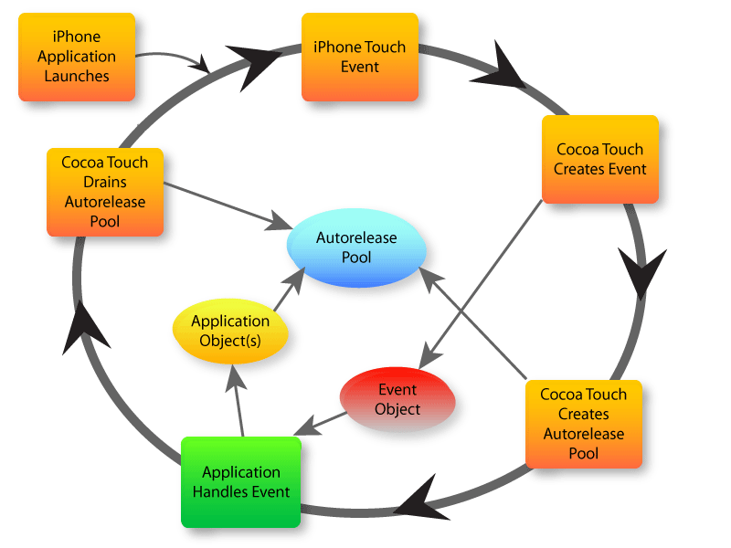
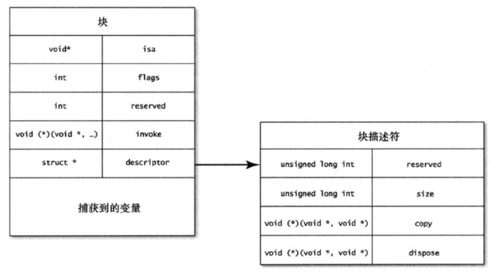
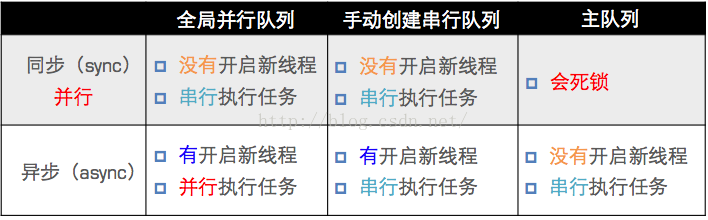
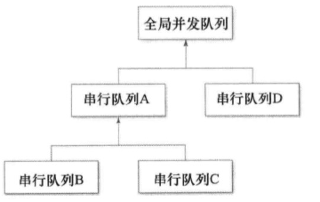

# 《Effective Objective-C 2.0》读书笔记  

## Objective-C 基础

### 1. 尽可能不在头文件中引入其他头文件  

- 编译其间，头文件并不关心引入文件的内部实现，可以使用 `@class someClass` 的`向前声明`方式通过编译。因为引入头文件后编译器就会把相应的头文件复制到引用的文件内，向前声明省略了这一步，可以减少部分编译时间；此外，向前声明也可以有效避免两个文件的循环引用导致编译不通过，以及文件间的耦合。  

- 在引入的头文件中包含协议等内容时，比较优雅的做法是声明一个 category，在这个 category 中再引入头文件，这么做的意义是为了降低彼此的依赖关系（书中表示还可以缩短编译时间，暂时没有理解）。个人理解是，这种方案遵循`只在使用时引用的原则`，因为协议肯定要搭配实现的代理方法使用，拆分出 category 用于统一管理代理方法，只有这个 category 需要代理的声明，原本的类是不需要的，这样就降低了category原有类和协议之间的依赖。如果不偏向这种设计，还可以将协议单独放到一个头文件，要引用时导入。
 

### 2. 尽可能多的使用字面量语法创建OC对象  

- 多使用如下字面量的方式代替使用方法的方式创建 OC 对象，这样做的目的是可以让代码简洁，字面量的方式也不过是OC的语法糖，方便创建对象的一种写法，实际还是需要调用方法，用这种方式创建，如果对象中包含 nil 会直接报错，方便定位，当然，不便之处在于不可变类型的对象不能用这种方式创建，解决方式也很简单，拷贝一份此类对象的可变副本即可

    ```objc
        //字面量
        NSString *strValue = @"我是一个字符串";
        //方法创建
        NSString *strMethod = [NSString stringWithFormat:@"我也是一个字符串"];
        //字面量
        NSNumber *numValue = @1;
        //方法创建
        NSNumber *numMethod = [NSNumber numberWithInteger:1];
        //字面量
        NSArray *arrValue = @[@"1",@"2"];
        //方法创建
        NSArray *arrMethod = [NSArray arrayWithObjects:@"1", @"2", nil];
        //字面量
        
        NSDictionary *dicValue = @{@"key1":@"value1",
                                @"key2":@"value2"};  
        //方法创建
        NSDictionary *dicMethod = [NSDictionary dictionaryWithObjectsAndKeys:@"value1", @"key1", @"value2", @"key2", nil];
    ```   

- 多使用下标的方式访问数组或者字典，原理和对象的创建一样，可以让代码看起来更简单易懂，而不是包含大量方法名   

### 3. 多用常量代替预处理指令 #define  

- `#define` 在编译器只做简单的替换处理，而常量可以显示比如类型等更多信息，而且使用const关键字可以防止使用过程中被修改  

- 使用 `static type const` 修饰编译单元内的常量，定义在编译单元的实现文件中，常量命名使用k作为前缀，使用这种方式定义的常量和#define定义的常量类似，但是只在编译单元内做替换工作，优势是包含类型信息  

- 使用 `extern type const` 修饰全局常量，命名使用类前缀作为修饰避免命名冲突，在头文件中声明常量，并在实现文件中给出常量的值  

### 4. 使用枚举表示状态相关内容  

- 使用枚举代替 int、string 等值代表的状态码，可以让程序更加通俗易懂，此外应该尽量使用系统定义的 NS_ENUM 类型或者 NS_OPTION 宏定义来定义枚举，这样可以自己定义枚举的类型  

- 在使用 switch 处理枚举时，不实现 default 分支。这样在我们新加入状态后，编译器会有警告信息，以便定位以及调整 switch  

## 对象、消息、运行时

### 5. 在对象内部尽量直接访问实例变量  

- 通过实例变量访问不会调用 setter 和 getter 方法，不经过消息转发，拥有更高的效率  

- 设置值时，使用属性会调用 setter 方法，这样可以跟踪属性设置的流向和进行断点调试  

- 实例变量的访问方式不调用 KVO  

- 使用属性设置值时需要注意，如果在子类中重写了 setter 方法，子类的初始化其实会调用重写的setter方法 

- 使用属性的访问方式更便于懒加载的实现  

- 属性和实例变量的方式选择要根据实际情况确定，主要的考虑因素是对象的访问需不需要经过 setter 或者 geter 方法，需要则使用属性，不需要则使用实例变量，一般在对象的初始化和 dealloc 方法中，总是应该使用实例变量读写数据  


### 6. “对象等同性”概念  

- 对象的对等，使用 `==` 对比的是两个对象的指针是否相等，结果并不一定正确，比如对比通过不同方式初始化的两个内容相等的字符串， `==` 的结果是不对等，而我们一般会期望相等。判断两个对象的对等关系，一般要使用 `NSObject` 类中的 "`isEqual`" 方法  

- `NSObject` 协议用于判断对象相等的是以下两个方法：  

    ```objC
        - (BOOL)isEqual:(id)object;
        - (NSUInteger)hash;
    ```   
    两个方法的默认实现都是当且仅当内存地址相同时才返回两个对象相等。只要对象遵守 `NSObject` 协议，我们便可根据自己的需求实现判断两个对象对等的规则。比如，两个对象的属性都对等时认为两个对象相等，而不需要两个对象的指针相同。以下是一个简单的实现：  

    ```objC   
        //.h
        @interface Person : NSObject   
        @property(nonatomic, copy) NSString *firstName;
        @property(nonatomic, copy) NSString *lastName;
        @property(nonatomic, assign) NSInteger age;
        @end
        
        //.m
        @implementation Person
        //isEqual
        - (BOOL)isEqual:(id)object {
        if (self == object) return YES;
        if ([self class] != [object class]) return NO;
        
        Person *tempPerson = (Person *)object;
        if (tempPerson.firstName != _firstName) return NO;
        if (tempPerson.lastName != _lastName) return NO;
        if (tempPerson.age != _age) return NO;
        return YES;
        }

        //hash
        - (NSUInteger)hash {
            return [_firstName hash] ^ [_lastName hash] ^ _age;
        }

        @end

    ```   

    `hash` 函数可以根据需求实现，甚至可以返回一个固定值，它对两个对象相等判断只起到一个辅助作用，相等的对象一定返回相同的 hash 值，而 hash 值相同的对象却不一定相等。其主要作用是在对象被添加到集合时，可以有较高的存取效率，如果返回一个固定的值，操作容器中的对象则每次都要去遍历整个碰撞后的链表，效率极其低下。所以， hash 函数需要实现一个碰撞少的算法，而 hash 值的生成也应该简单高效。  

- 如果需要频繁的调用对等性的判断，还是建议自己创建对等性方法而不是重写 `isEqual` 方法，一方面是减少了类型判断提升效率，一方面又能保障代码逻辑和结构的清晰  

- 集合类型也有等价判断方法，`isEqualToArray`, `isEqualToDictionary` 分别对应数组和字典，方法默认会首先判断对应位置的对象类型是否相同，如果相同，继续调用 `isEqual` 判断两个对象是否相等，直到所有位置对象相等才会返回两个集合相等。集合的相等涉及同等性深度，如果判断两个集合并不需要所有位置的对象都完全相等，可以自定义对等方法提高效率   

- 可变类型对象加入容器可能导致修改后的对象被放入"`错误`"的位置，比如在一个 NSSet 中添加两个可变数组，然后修改其中一个数组使其值与另一个相同，这样 NSSet 中就出现了两个相同的元素，这明显是不合理的，在添加可变对象到容器中时要格外小心。另一方面，对象加入容器根据 `hash` 值决定位置，所以，生成 `hash` 值时应尽量使用不可变部分  

### 7. 类簇  

- 使用类簇配合工厂方法可以把各种个性化的实现细节隐藏到一系列公共接口之后  

- 类簇中某一个子类对象的实例的类型和类簇的类型是不一样的  

### 8. 关联对象  

- 可以使用运行时的关联相关方法，在运行时给一个对象动态的绑定属性，记录一些之后使用的信息，可以让代码更加聚合  

- 关联对象方法需要慎用，绑定的对象是在运行时添加，很难通过常规的 DeBug 手段定位问题  

### 9. 关于 obj_msgSend  

- 理解 OC 与 C 之类静态语言的区别主要是理解动态绑定和静态绑定的区别，简单理解，程序执行过程中需要调用的函数是在编译期就已经决定还是运行过程中才能决定   

- obj_msgSend 会维护一个快速访问方法列表，每次有方法调用都会更新这个列表保障方法在下次能够更快速便捷的检索    

- 在一些边界情况下，OC 运行环境会调用一下函数做特殊处理：  

    - obj_msgSend_stret: 处理调用函数返回结构体的问题  

    - obj_msgSend_fpret: 处理调用函数返回浮点数的情况，因为在不同架构的CPU上，浮点数存在差异 

    - obj_msgSendSuper: 处理发送给超类的消息  

- obj_msgSend 使用"`尾调用优化`"技术使调用函数跳转变得更简单  

### 10. 消息转发  

- OC 作为一门动态语言，在对象接受一个无法解读的消息时，并不会直接报错而是进入消息转发流程，消息转发分为以下两个阶段，只有以下两个阶段都没有正常处理消息时，才会报错：  

    - 动态方法解析：  

        很多文章提到在对象接收到一个未知消息时会有两次拯救机会，动态方法解析便是第一次，未知消息会流向 "`+ (BOOL)resolveInstanceMethod:(SEL)sel`" 方法，对应类方法的还有 "`+ (BOOL)resolveClassMethod:(SEL)sel`" 方法。在消息流向这两个函数时，如果在函数内部实现了对未知消息的处理，消息便可以被正常处理   

    - 备选接收者：  

        在动态方法解析失败后，第一阶段还有最后一次拯救这个消息的机会， "`- (id)forwardingTargetForSelector:(SEL)aSelector`" 方法可以让当前消息接收者选择一个转发对象，让这个对象处理这个消息。`OC 中没有多重继承的机制，但是使用这个方法便可让一个对象内部处理多种类型的消息，对外表现和多重继承类似`  

    - 完整消息转发：  

        系统会创建一个 NSInvocation 对象，封装消息包含的所有信息和细节，最后进入最终的转发阶段，流入 "`- (void)forwardInvocation:(NSInvocation *)anInvocation`" 方法，该方法与备选接收者实现基本一致，负责把消息转发出去，因为已经经过了备选接收者阶段，因此这一步不能仅仅是简单的转发，而是需要触发消息前对消息进行部分调整，如改变参数或者选择子。如果在当前类无法处理则会调用父类的方法处理，直到 NSObject。当消息流入 NSObject 类，说明这个消息是无法处理的消息，最终会调用 "`- (void)doesNotRecognizeSelector:(SEL)aSelector`" 抛出异常结束整个消息转发过程  

- 以下是整个消息转发的流程图：  

      

    消息在每一步都可能会被处理，越往后处理的代价越大，需要处理的内容也越多，因此应该尽可能早的处理消息  

    消息转发可以参考 [Demo](https://github.com/zj-insist/EffectiveObjCDemo) 项目 `EOCAutoDictionary` 中的内容  

### 11 .方法调和(Method Swizzing)  

- 可以在运行时对不了解实现细则的现有方法进行扩展，最通常的用法是为现有方法添加日志打印功能，也可对基类的某些子类调用达到让子类个性化的作用  

- 不要滥用 Method Swizzing。Method Swizzing 可以在任意时刻调用，如果产生问题将难以追踪  

### 12. 理解 “类对象”  

- OC 中，一个类拥有如下结构：  

    ```objc
        struct objc_class {
            Class isa  OBJC_ISA_AVAILABILITY;
        #if !__OBJC2__
            Class super_class                       OBJC2_UNAVAILABLE;  // 父类
            const char *name                        OBJC2_UNAVAILABLE;  // 类名
            long version                            OBJC2_UNAVAILABLE;  // 类的版本信息，默认为0
            long info                               OBJC2_UNAVAILABLE;  // 类信息，供运行期使用的一些位标识
            long instance_size                      OBJC2_UNAVAILABLE;  // 该类的实例变量大小
            struct objc_ivar_list *ivars            OBJC2_UNAVAILABLE;  // 该类的成员变量链表
            struct objc_method_list **methodLists   OBJC2_UNAVAILABLE;  // 方法定义的链表
            struct objc_cache *cache                OBJC2_UNAVAILABLE;  // 方法缓存
            struct objc_protocol_list *protocols    OBJC2_UNAVAILABLE;  // 协议链表
        #endif
        } OBJC2_UNAVAILABLE;
    ```   

    还需根据类的结构理解如下这张图：  

       

    OC 中关于类的内容比较多，可以在网上搜索相关概念   

## 接口与 API 设计   

### 13. 使用前缀避免命名冲突  

- 使用前缀避免命名空间冲突， Apple 宣称保留所有两个字母前缀的权利，因此根据规范，我们应该至少使用三个字母的前缀来避免命名空间冲突  

- 理论来说，不仅仅是类，类中的方法也应该添加前缀，因为实现文件中所有的纯 C 函数以及全局变量都会被认为是顶级符号，如果别的文件再声明相同名称的方法，就会出现问题  

- 实现一个第三方库时要格外小心引入其他第三方库，即便要引入也要将这个第三方库的所有命名加上当前实现的第三方库的前缀，不然使用者在引入这个第三方库和这个第三方库中引入的库时，就会出现命名问题  

### 14. 指定初始化方法  

- 一个类可以有数个初始化实例的方法，但是应该至少有一个是“`指定初始化方法`”，这个方法要包含初始化所需的所有必要信息，而其他的初始化方法应尽量是调用“`指定初始方法`”完成初始化，这样有一个统一入口，如果需要对初始方法做一些修改，只用修改很少代码  

- 子类的“`指定初始化方法`”应该也尽量调用父类的“`指定初始化方法`”，必要的情况下，子类需要重写父类的“`指定初始化方法`”达到即使子类调用父类初始化方法，初始化后的对象也是满足子类需求，或者在子类调用父类初始化方法时直接抛出异常    

- 特定情况下，需要不止一个“`指定初始化方法`”   

- “`指定初始化方法`”还有很多需要注意的内容，具体可以参考[这里](http://www.cnblogs.com/smileEvday/p/designated_initializer.html)，相关实例代码，可以参考 [Demo](https://github.com/zj-insist/EffectiveObjCDemo) 项目`Designated` 中的内容   

### 15. 尽量使用不可变对象  

- 在声明对象的属性时，对于不会被修改的属性，应尽量使用 `readnoly` ，这样可以避免一些未知问题  

- 如果某对象只可对对象内部修改，则应该在其分类中将 `readnoly` 扩展为 `readwrite`  

- 尽量不要把可变类型的容器在属性中公开，而是开放一系列修改这个属性的方法  

### 16. 为私有方法名添加前缀  

- 为私有方法添加前缀用于区分私有方法和公共 API ，由于公共 API 不能随意更改，使用前缀区分便可了解哪些方法名是可以变动的  

- 避免使用单一下划线作为私有方法前缀， Apple 框架中的私有方法以单一下划线开头，如果使用单一下划线可能会出现覆盖父类私有方法的问题  

### 17. NSCopying 协议  

- 如果想要自定义的类支持 copy 功能，则需遵从 NSCopying 协议并实现 `- (id)copyWithZone:(nullable NSZone *)zone` 方法，同理 MutableCopying 则需要实现 `- (id)mutableCopyWithZone:(nullable NSZone *)zone` 方法，以下是一个简略的实现：  

    ```objc
        - (id)copyWithZone:(NSZone *)zone {
            Person *newPerson = [[self class] allocWithZone:zone];
            newPerson.lastName = [_lastName copy];
            newPerson.firstName = [_firstName copy];
            newPerson.age = _age;
            
            return newPerson;
        }
    ```  

- copy 返回的是不可变对象的拷贝， mutableCopy 返回的是可变对象的拷贝  

- 对于容器类型，需要额外关注深拷贝和浅拷贝，系统方法一般只执行浅拷贝，如果需要深拷贝需要额外添加实现或者调用系统已有方法  

- 如果仅仅需要使用浅拷贝不要深拷贝对象，浅拷贝效率远高于深拷贝  

## 协议与分类  

### 18. 数据源与委托  

- 关于 `dataSource` 和 `Delegate`，两者的区别是数据流向的不同，一句话概括，数据源代理的信息是从代理流向类，委托的信息是从类流向代理对象。以 UITableView 相关的数据源和代理举例，有返回值的委托方法是数据源方法，没有返回值的委托方法便是普通代理方法，当前 VC 作为 UITableView 数据源，提供返回值便是提供了信息流向， UITableView 根据返回的值决定渲染的数量以及各种信息；同时，当前 VC 也作为 UITableView 的委托对象，当 UITableView 发生用户交互事件时， UITableView 中的交互信息便流向了委托对象，由委托对象决定怎么处理这些信息。下图反映了两者的异同和信息流向：  

       

- 因为在程序运行过程中，只要委托对象没有变化，其对于一个选择子的响应状态是相对固定的，不可能突然可以响应或者不能响应，因此可以在设置代理时存储选择子的调用状态，这样就不用频繁的调用 `respondsToSelector` 方法去检查能否调用。使用一个结构体可以很好的表述代理方法的响应情况。由于响应状态只可能存在两种情况，因此，使用一位（bit）就可以表示，使用 `位段` 的方式可以更加优化这个表述，示例代码如下：  

    ```objc
        //.h
        @protocol PreferDelegate
        @optional
        - (void)delegateMethodA;
        - (void)delegateMethodB;
        - (void)delegateMethodC;
        @end

        @interface PreferDelegateClass : NSObject
        @property(nonatomic, weak) id<PreferDelegate> delegate;
        @end

        //.m
        @interface PreferDelegateClass()
        {
            struct {
                unsigned int methodA : 1;
                unsigned int methodB : 1;
                unsigned int methodC : 1;
            } _delegateFlags;
        }
        @end

        @implementation PreferDelegateClass

        - (void)setDelegate:(id<PreferDelegate>)delegate {
            _delegate = delegate;
            
            _delegateFlags.methodA = [delegate respondsToSelector:@selector(delegateMethodA)];
            _delegateFlags.methodB = [delegate respondsToSelector:@selector(delegateMethodB)];
            _delegateFlags.methodC = [delegate respondsToSelector:@selector(delegateMethodC)];
        }

        - (void)callMethodA {
            if (_delegateFlags.methodA) {
                [self.delegate delegateMethodA];
            }
        }

        @end
    ```    

    具体代码可参考 [Demo](https://github.com/zj-insist/EffectiveObjCDemo) 项目 `PreferDelegate` 中的内容

### 19. 将一个复杂功能的类拆分到几个分类中实现  

- 通过拆分一个类可以使结构更清晰也更容易 Debug  

- 在一些特定情况下，可以声明一个单独的分类，用于存放框架内调用但不对外开放的方法合集  

### 20. 为第三方分类名称加前缀   

- 向第三方类添加分类时，应添加前缀避免命名冲突  

- 向第三方类添加分类时，应该给分类中的方法添加前缀，否则可能存在覆盖问题  

### 21. 分类中不建议声明属性  

- 一般来说，分类中声明属性是无法合成实例变量的，因此声明是没有作用的，但是可以通过运行时的一些机制绑定对象，但这样容易出现内存管理问题，所以，一般非必须不建议在分类中声明属性  

- 另一方面，在分类中声明属性一般是为了重写 setter 和 getter 方法，使用这些方法做一些便捷操作  

### 22. 类扩展  

- 类扩展在声明形式上可以简单理解为匿名的分类  

- 通过扩展可以向类中添加实例变量  

- 可以在扩展中将声明为只读的属性扩展为对内的读写属性  

- 可以在扩展中对外隐藏遵循的协议  

- 可以优雅的兼容 C++ 相关代码  

### 23. 协议的其他作用  

- 协议可以是接口声明的说明文件，给出一个规范，只要遵循此协议的对象，都要根据协议中约束的规范实现，这点很像 Java 中的接口文件  

- 协议可以聚合一类对象，不必关心这类对象的具体类型，而只关注这些对象是不是遵循同一个协议  

- 协议可以变相的实现多继承的特性  

- 协议还可以起到隐藏类型名或者类名的作用  

## 内存管理  

### 24. 理解 ARC  

- 理解 ARC 相对 MRC 为我们简化了哪些操作，这些操作在 MRC 下的作用是什么  

- 理解 MRC 中 `setter` 方法的写法，其保留和释放对象的原因   

- 使用 `weak` 关键字不必担心崩溃，因为在系统对象被回收后所指区域会被置空，不会出现访问到非法对象的情况，但还是要在使用时小心，以免得到错误的结果  

- ARC 只管理 OC 对象，对于非 OC 对象的使用要更加小心，需要做到谁使用谁释放的原则  

### 25. 关于 dealloc   

- `dealloc` 中应该释放对象引用，取消 KVO 监听以及通知监听，在其中不要调用对象的其他方法，因为此时对象处于被销毁状态，调用方法可能会出错  

- 系统在有些情况下可能不会调用 `dealloc` 方法，一种是因为产生了循环引用导致对象无法正常释放，另一种则是因为系统的优化处理，比如程序即将退出时，程序退出会回收所有资源，因此这时候无需再多一次释放  

- 并不是所有对象的释放都应该放到 `dealloc` 中，因为 `dealloc` 只有在对象即将被销毁时被调用，而有些占用资源很多的对象应该尽早释放  

### 26. 异常
 
- 在 OC 中尽量少使用异常，在 ARC 环境下，因为异常出现之后的代码都不会被执行，系统也默认不会生成异常清理代码，可能会导致内存泄露，而如果添加此类异常清理代码又会使程序膨胀   

### 27. 使用 weak 避免循环引用  

- __unsafe_unretained 修饰的对象表明该对象可能无法使用，是不安全的，作用与 assign 类似， assign 主要用于非对象类型，而 __unsafe_unretained 用于对象类型，之后添加的 weak 关键字可以很好的代替 __unsafe_unretained ，weak 在 __unsafe_unretained 功能的基础上添加对已经释放的对象自动置 nil 的操作  

- 使用 weak 打破循环引用以确保系统中的对象都能被合理释放  

- 垃圾回收机制可以解决循环引用的问题，没有被外界对象引用的成为闭合环引用的一系列对象被认为是孤岛，会默认被系统回收。iOS 平台抛弃垃圾回收机制的原因，一方面是垃圾回收机制因为算法层面还存在一些无法处理的特殊情况，另一方面则是垃圾回收机制需要系统额外的跟踪对象的状态，比较消耗性能  

### 28. 自动释放池  

- 自动释放池是一个栈结构，对象收到 autorelease 消息后，系统会将其放入栈顶等待推出  

- 数组的遍历推荐使用 block 方法是因为这类方法会对循环添加自动释放池，避免对象过多时导致内存暴涨  

- 在自动释放池内部创建的对象无法在外部被使用  

- 关于自动释放池的释放时机可以参考下图：  

      

    > 可以看到，每个 runloop 中都创建一个 Autorelease Pool，并在 runloop 的末尾进行释放，所以，一般情况下，每个接受 autorelease 消息的对象，都会在下个 runloop 开始前被释放。也就是说，在一段同步的代码中执行过程中，生成的对象接受 autorelease 消息后，一般是不会在作用域结束前释放的。  
    所以严谨的说, 在没有手动添加 Autorelease Pool 的情况下，Autorelease 对象是在当前的 runloop 迭代结束时释放的，而它能够释放的原因是系统在每个 runloop 迭代中都加入了自动释放池 Push 和 Pop。  

- 更多自动释放池的机制可以参考这几篇文章：  
 
    [Autorelease 机制及释放时机](http://blog.csdn.net/wangyanchang21/article/details/51037831)

    [自动释放池的前世今生 ---- 深入解析 autoreleasepool](https://draveness.me/autoreleasepool)  

    [黑幕背后的 Autorelease](http://blog.sunnyxx.com/2014/10/15/behind-autorelease/)   


### 29. 不要使用 retainCount  

- retainCount 可能会不准确的原因是，自动释放池的时机是不一定的，当对象被加入自动释放池，可能在某一时间点还没有被 release ，这个时候调用，但下一刻自动释放池执行后对象的 retainCount 就已经改变了  

## Block 与 GCD  

### 30. 理解 Block  

- 声明 block 范围内的所有变量，都可被 block 所捕获，免去了重新声明函数的变量传递  

- 一般来说， block 内不可修改捕获的对象，但加上 `__block` 关键字后，相当于传入了引用，可以修改  

- block 内会保留捕获的对象类型，因此，在 block 中使用对象时要使用 `__weak` 关键字修饰，同时，为了避免对象被释放导致 block 中内容执行错误，需要使用 `__strong` 关键字修饰捕获的对象起到保留作用  

- block 可以直接修改实例对象而不需要添加 `__block` 关键字修饰  

- block 的内存布局：  

    

    除了一些基本信息， block 中最主要的是 invoke 指针，它指向 block 代表的匿名函数，通过封装让 block 的使用更加便捷；此外 descriptor 结构体中包含了 block 的基本信息，copy 和 dispose 是两个辅助函数对应的指针，这两个函数分别在 block 被拷贝和释放时调用。最后，block 中还会包含捕获的对象的地址信息以供运行使用  

- 在定义好 block 并给其赋值后，需要调用 copy 保存 block 的引用把 block 从栈上移动到堆上，否则 block 可能在声明后的作用域结束后便已经被回收了   

- 全局 block 类似单例，在不会被系统所回收，而其中所需的信息也是在编译器便可确定  

- 使用 `typedef` 给 block 定义一个别名可以让 block 表述更加明确也更易统一修改  

### 31. block 的一些使用技巧  

- 使用 block 代替 delegate 处理异步等相关内容可以使代码更加简洁和聚合  

- 尽量使用一个 block 处理网络请求的成功和失败两种情况，虽然这样可能会令一个 block 里代码过长，但是我们可以根据返回的值以及错误信息更加灵活的处理各种情况，而不是必须在成功或者失败的 block 中去分别处理  

- 设计 API 时，如果使用 block 的方式进行回调，可以添加一个队列的相关参数，用于指定这个操作是在哪个队列完成  

- 使用 block 时，一定要注意循环引用问题，如果不使用 `__strong` 和 `__weak` 关键字，则一定要在必要的时候打破整个循环引用使对象可以正常释放  


### 32. GCD  

- GCD 拥有比一般锁更高的执行效率   

- 使用 `dispatch_barrier_sync(dispatch_queue_t  _Nonnull queue, ^(void)block)` 来做一些操作的同步可以使同步更加高效  

- 尽量不要使用 `performSelector:` 方法，该方法可能会在 ARC 下导致内存泄露。编译器不知道要调用的选择子是什么，不了解方法签名以及是否有返回值，也不知道方法名，就没法使用 ARC 管理这块区域，所以 ARC 的做法是不去管理，这就可能导致内存泄露  

### 33. NSOperation  

- NSOperation 与 GCD 都拥有队列的概念，因为 GCD 使用 C 实现，拥有更高的效率， NSOperation 的优势则是作为 OC 对象，更切合 OC 语法，而且还封装了很多相对 GCD 更加便捷的操作   

- NSOperation 可以取消未开始的操作，已经开始的无法取消。相对 GCD 这种创建任务后就不需要关心任务的状态，这种取消操作在一些情况下可能更为便捷   

- 可以指定依赖关系，指定 A->B->C 的依赖关系，使线程可以更容易的协作  

- NSOperation 支持 KVO，开发者可以对线程的工作状态进行更为细致的处理    

- 可以在同一个队列中指定线程的操作优先级， GCD 虽然拥有队列优先级的概念，但是在队列中没有优先级的划分，这样在实现调度算法相关内容时可以更为便捷  

- NSOperation 作为对象，可以保存操作，因此可以先声明一个 NSOperation ，在需要使用时再调用，而 GCD 则是使用时再声明并调用  

### 34. GCD 队列和 Group  

- 关于主队列、全局队列以及自定义队列和同步、异步任务的的使用关系可以参考下图：  

       

- GCD 中使用 Group 同步几个任务， `dispatch_group_async` 函数用于指定任务所属 Group，将所有任务都加入 Group，当所有任务都执行完毕后，使用 `dispatch_group_notify` 同步几个任务， `dispatch_group_wait` 用于指定在 Group 中任务完成前等待多久，因为会阻塞当前线程，一般不建议在主线程使用  

- `dispatch_group_enter(group)` 与 `dispatch_group_leave(group)` 需要成对出现，相当于信号量同步各个任务，最终也是调用 `dispatch_group_notify` 同步 Group 中的任务  

- 同一个组中的任务可以被放到不同的队列中执行，这样可以区分任务的优先级  

- `dispatch_apply(size_t iterations, dispatch_queue_t  _Nonnull queue, ^(size_t)block)` 可以更高效的执行一个循环，它接收三个参数，第一个是 `iterations` 表示执行循环的次数，会执行 `iterations - 1` 次，第二个表示执行循环操作的队列，此处可以使用一个并行队列，最后是一个执行内容，可以再这里根据传入的 index 不同决定执行不同的代码。之所以更高效是因为这个循环可以使用并行队列，循环的内容会被分发到不同的线程执行，任意时刻可以有数个不同的线程同时执行，所以，如果对结果的顺序没有要求可以使用此方法代替一般循环方式提高效率  

    ```objc
        - (void)applyTest {
            //可以更高效率的执行一个循环
            dispatch_apply(10, dispatch_get_global_queue(DISPATCH_QUEUE_PRIORITY_DEFAULT, 0), ^(size_t index) {
                NSLog(@"%zd",index);
            });
        }

        2018-02-06 17:44:20.074123+0800 EffectiveObjCDemo[14902:703444] 0
        2018-02-06 17:44:20.074349+0800 EffectiveObjCDemo[14902:703444] 4
        2018-02-06 17:44:20.074143+0800 EffectiveObjCDemo[14902:703445] 1
        2018-02-06 17:44:20.074357+0800 EffectiveObjCDemo[14902:703444] 5
        2018-02-06 17:44:20.074167+0800 EffectiveObjCDemo[14902:703446] 2
        2018-02-06 17:44:20.074363+0800 EffectiveObjCDemo[14902:703444] 6
        2018-02-06 17:44:20.074370+0800 EffectiveObjCDemo[14902:703444] 8
        2018-02-06 17:44:20.074371+0800 EffectiveObjCDemo[14902:703445] 7
        2018-02-06 17:44:20.074376+0800 EffectiveObjCDemo[14902:703446] 9
        2018-02-06 17:44:20.074175+0800 EffectiveObjCDemo[14902:703262] 3
    ```

    需要注意的是， `dispatch_apply` 会阻塞当前线程直到循环结束，因此使用时需要额外小心  

    关于 GCD 的内容比较多，更多可以参考网上资料，[Demo](https://github.com/zj-insist/EffectiveObjCDemo) 项目 `GCD` 中列出了了部分方法的使用参考  

### 35. dispatch_once  

- `dispatch_once` 可以更高效的保障其中的代码只被执行一次而无需关心是否线程安全，用在单例的初始化上尤其便捷  

### 36. dispatch_get_current_queue 可能导致问题  

- dispatch_get_current_queue 用于获取当前执行的队列，然而使用它作为逻辑判断会有问题，因为队列存在一个层级的概念，具体如下图：  

      

    可以看到，在队列 B 和 C 中的任务，虽然调用 dispatch_get_current_queue 方法返回的是队列 B 和队列 C，然而，他们同样是在队列 A 中的任务，如果不去关注与队列 A 的逻辑关系，很容易造成队列 A 中产生死锁，因此一般不建议使用 dispatch_get_current_queue 函数作为队列判断  

## 系统框架  

### 36. 集合遍历  

- 如果处理器性能有盈余，在遍历集合时使用 block 的方式可以选择在多个线程中同时执行遍历提高效率，其原理类似 GCD 中使用 apply 函数  

### 37. 构建缓存使用 NSCache 代替 NSDictionary  

- NSCache 和 NSDictionary 功能类似，但是在构建缓存时 NSCache 拥有更多优势：  

    - NSCache 可以指定容量和内容的最大开销，当容量或者开销大于给定值时，会自动使用最近最少使用算法选择其中的内容进行丢弃，而 NSDictionary 要实现这样的功能需要编写相关逻辑  

    - NSCache 是线程安全的，我们可以放心的使用，而不必关心因为异步导致的数据不同步  

    - 可以通过指定的容量和内容最大开销来操控缓存的删除时机，虽然可以控制删除时机，但是想要通过此方式删除指定对象是不合理的，具体删除哪个对象是根据具体实现决定的  

- 添加对象到 NSCache 时可以设置开销值，这样可以使缓存更容易的决定何时移除对象，当然并不是每次加入缓存时给定开销都是合理的，如果加入缓存的对象开销很难计算或者计算周期过长，这时还计算开销，显然是不合理的  

-  NSPurgeableData 与 NSCache 搭配使用可以实现数据自动清除的功能，当 NSPurgeableData 对象的内存被系统回收后，缓存中会自动移除这个对象  

- 缓存的作用是为了节省一些费时操作而做的短暂存储，应该理解和合理应用这种机制  

    缓存的设计无非是提高整个程序的运行效率，设计方案都大同小异，可以参考 YYCache 看看如何实现一个优秀的缓存，[Demo](https://github.com/zj-insist/EffectiveObjCDemo) 项目 `NSCache` 中列出了 NSCache 的简单使用   

### 38. 精简 initialize 和 load 函数  

- 当分类和其所属的类都定义了 load 方法，会先调用类里的 load 方法再调用分类的，load 方法不参与覆写机制    

- load 函数执行时，系统处于“脆弱时期”，这个时候哪些类加载哪些类没有加载并不清楚，因此尽量不要在类的 load 方法中调用其他类  

- load 方法运行时整个程序是被阻塞的，无法响应，因此，应该精简 load 中执行的操作，同时不要在 load 中添加锁相关的等待内容  

- initialize 方法只有在系统第一次使用此类时调用，而且只会调用一次，而 load 方法则是在系统运行时，所有类的 load 方法都会被调用。initialize 方法只能由系统调用，绝不应该主动调用   

- initialize 是线程安全的，此外， initialize 方法执行时，系统是处于正常状态的，可以在此时调用其他类  

- 如果子类没有实现 initialize 方法，便会便会调用父类的 initialize 方法  

- initialize 通常用来初始化在编译期无法设定的全局变量  

- 不要过分依赖 initialize 和 load 方法执行类的初始化，如果可行应该提供一个初始化方法给使用者，让使用者每次使用该类时调用，单例便是一个很好的例子  

### 39. NSTimer 会保留目标对象  

- NSTimer 需要放入“运行循环”中才能生效，放入不同模式的运行循环会有不同的效果   

- NSTimer 不使用后一定要调用 invalidate 方法停止，并在之后将其置为 nil

- 使用 NSTimer 时可能会产生循环引用，因为 NSTimer 会保留其引用的对象，使用 block 的方式可以避免这种循环引用  

    ```objc   
        @implementation NSTimer (EOCBlocksSupport)

        + (NSTimer *)eoc_secheduleTimerWithTimeInterval:(NSTimeInterval)interval block:(void(^)(void))block repeats:(BOOL)repeats {
            return [self scheduledTimerWithTimeInterval:interval target:self selector:@selector(eco_blockInvoke:) userInfo:[block copy] repeats:repeats];
        }

        + (void)eco_blockInvoke:(NSTimer *)timer {
            void (^block)(void) = timer.userInfo;
            if (block) {
                block();
            }
        }
        @end


        @interface PracticeClass()

        @property(nonatomic, strong) NSTimer *timer;

        @end

        @implementation PracticeClass

        - (void)dealloc {
            [_timer invalidate];
        }

        - (void)stopTimer {
            [_timer invalidate];
            _timer = nil;
        }

        - (void)starTimer {
            __weak __typeof(self)weakSelf = self;
            _timer = [NSTimer eoc_secheduleTimerWithTimeInterval:5 block:^{
                __strong __typeof(weakSelf)strongSelf = weakSelf;
                [strongSelf doSomething];
            } repeats:YES];
        }

        - (void)doSomething {
            NSLog(@"%s",__func__);
        }

        @end
    ```   

    如上方式，因为使用了 __weak 关键字，使 NSTimer 不再保留当前对象，打破了整个循环引用，因此对象都可正常释放

- 在 dealloc 中不要使用 self 关键字，此时 self 可能已经被销毁，无法使用，应该使用带下划线的实例变量  


