# 多一条闹心，少一条难受——简述 UITableView 分隔线的一些细节处理

最近做项目的过程中，多次使用了 tableView，然而根据功能和视觉效果的不同，每个界面都有自身特定的样式或者有一些会导致 tableView 变动的功能，例如添加和删除操作。在调整诸多界面样式的时候，发现分隔线上的坑还是挺多的，光在样式的选择和调整中就遇到了相当多的问题。此外，之所以要提到编辑操作，也是因为编辑操作同样会影响分隔线的显示。以下，将以当前主流的界面UI构建方式聊一聊有关分隔线和 section 之间间隔的处理。  

### 1、聊聊 TableView 的样式
首先看一下当前主流APP的设置相关页面的UI显示： 

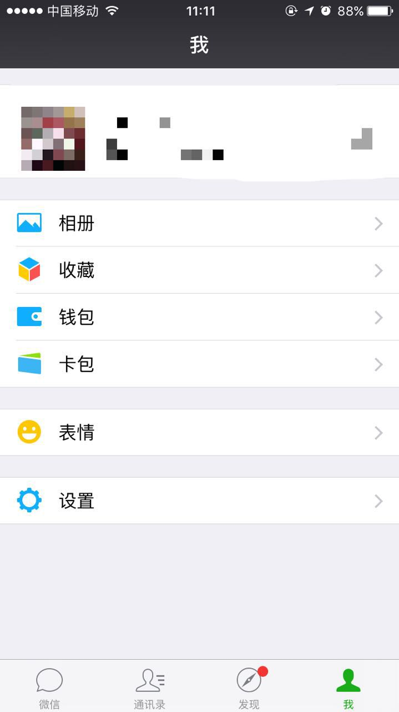  

  

两种 table 的整体结构很类似，都在 cell 中的分隔线进行了缩进，不同的处理在对同一个 section 的首尾分隔线上。第一种是在 section 的首尾添加没有缩进的分隔线，第二种则是去掉了 section 的首尾分隔线。这两种样式便分别是系统提供给我们的 Group 和 Plain 样式，以下分别为未经处理的两种样式，为了便于区分，我把分隔线设置为红色，两个 table 的数据源都是一样的，分为3个 section，每个 section 中4条数据：  

Plain 样式   
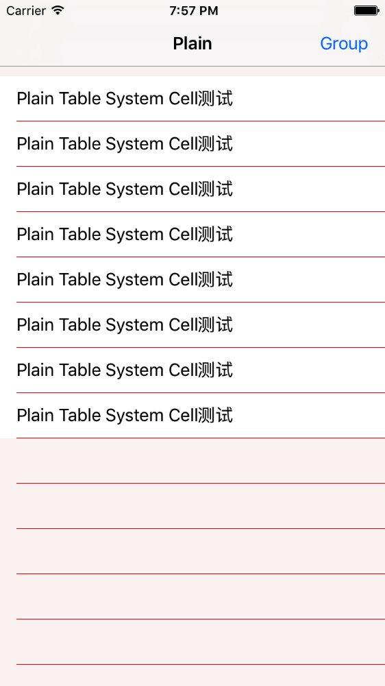  

Group 样式  
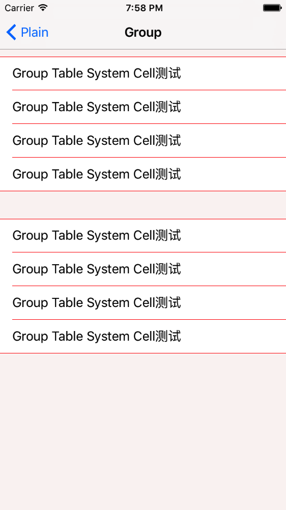  

两个 table 的高度都为除掉Nav的整个屏幕大小，除了添加了一个为了便于区分起始位置的10个点高的 tableViewHeader，没有做过其他处理。可以看到，两种样式，系统都会在 cell 分隔线的头部位置给15个点的缩进，Plain 样式下，如果 cell 数量可以在一屏全部显示而且屏幕空间有空余，系统会默认显示屏幕内还能容纳多少 cell，如果整个屏幕没有内容，table 也会像笔记本一样显示每行的分隔线，从 View UI Hierarchy 也可以看到，多出来的空间并没有创建空白 cell，只是显示了 cell 相应的分隔线。除此之外，Plain 样式没有对 table 进行特殊处理。添加一个空白的 footerView 可以删除多余的分隔线：  

```objc  
self.tableView.tableFooterView = [[UIView alloc] init];
```  

Group 模式下，系统则默认帮我们做了很多处理，首先是，单独处理 section 头尾的分隔线，去掉15个点的缩进；然后，对每个 section 默认添加了头尾 view 的高度为18个点，从下图的打印也可以看到，同样打印 Plain 样式下的高度则为-1：  

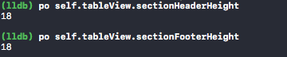  

而且在不设置头尾高度的情况下，Group 会默认去掉第一个 section 的 headerView，但是如果自定义了 headerView 的高度，则系统不会默认处理第一个 section 的 headerView。  
还有一个有趣的现象，当我只分别自定义了两种样式的 headerView 或者 footerView 的高度，但是不自定义 View 时，Plain 样式会在每个 section 的 header 或者 footer 的位置拼接一个 View，即会创建一个新的 View，但是 Group 则仅仅是空出设定好的位置。系统这样处理也很好理解，根据官方给出的 Plain 和 Group 的描述：  

> Plain 样式的 section 的 header 和 footer 会在滚动的时候有粘滞性效果，粘滞在当前的 section 的头或尾，直到整个 section 滚动出屏幕。一个 tableView 可以有一个 index，作为一个 bar 在 table 的右边（例如，A ~ Z)。你可以点击一个特定的标签，跳转到目标 section。  

> grouped 样式为所有单元格提供了一个默认的背景颜色和默认背景视图。背景视图为特定 section 中的所有 cell 提供可视分组。在 grouped 样式表中不能有一个 (右边的) 索引。

具体来说，Plain 样式就是通讯录的效果，我们在滚动的过程中，无论滚动到一个 section 的什么位置，都可以看到其 header 上的索引，直到这个 section 完全滚出屏幕，header 才会跟随滚出屏幕。同时，我们也还可以在右侧创建一个索引，以供快速跳转到指定 section。而 Group 默认则更像我们通常使用的 table，header 和 footer 都会跟随 cell 的滚动，在一般情况下，Group 的 header 或者footer 都是为了给 section 做一个简单的可视分组。  

简单总结，Plain 样式主要是提供给需要可粘滞性的头部或者尾部视图的情况下使用，而 Group 则更适用于一些静态 cell 的情况，单纯的提供分组的视觉效果。

### 2、该死的分隔线——系统分隔线  

聊完了 table 的两种样式，然后根据官方的介绍和上一章最后的总结来看，事情似乎相当简单，不想要粘滞性效果的用 Group，需要粘滞性效果的用 Plain。是的，就这么简单，然而也是这么的 naive。从需求入手，先说说来实现类似美团一样的不需要 section 头尾分隔线的样式，我们先不自己去定义分隔线，而是采用系统分隔线去实现类似效果。首先选择 table 的样式，理论来说，应该选用 Group 样式，然后只用处理每个 section 头尾的分隔线便可。然而，现实情况是，只要不是自定义的分隔线，就我目前了解到的方法，是没有办法处理 Group 样式下的头部分隔线的，如果有，也欢迎交流。从 Group 最终展示效果来说，一般会存在 cell 数量 +1 条的分隔线，因此，多出的一条分隔线应该是加在整个 setion 上或者是某个 cell 上的。观察一下 Group 样式下的 cell 的 View UI Hierarchy 如下图所示：  

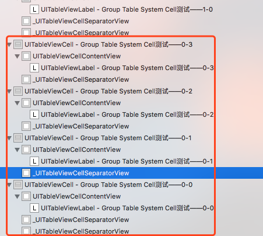   

 红框内是一个 section 内的所有 cell，为了表明不是特殊情况，我多截图了一个另外 section 的头部 cell。可以看到在整个分部中，每个 section 的第一个 cell 都会多出一个 SpearatorView。既然可以在结构中看到，那能不能拿到呢？从结构图打印 cell 的 subviews，如下图：  

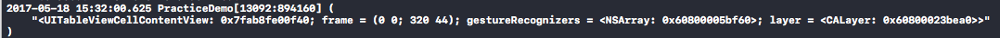   

所以，拿不到…其实，不管是不是头部的 cell 我们都是无法拿到这个 cell 的分隔线实例的。既然拿不到分隔线的实例，那直接用常规的设置分隔线的偏移是什么效果呢？设置分隔线的偏移：    
```objc
if (indexPath.row == 0) {
        cell.separatorInset = UIEdgeInsetsMake(0, 0, 0, Screen_Width);
    }
```  

此处不能设置左侧的偏移，一旦设置 cell 中的 label 也会跟随偏移导致显示出现问题，结果如图：  

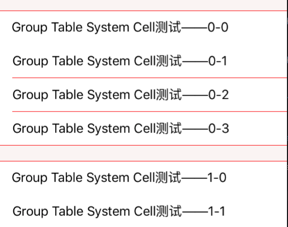   

并没有达到预期的效果，仅仅只能提供底部分割线的偏移量，因此在 Group 样式下，使用系统自带的分隔线无法达到理想效果。当然自定义 cell 可以达到我们想要的效果，但是自定义分割线也是存在问题的，这个放在下一章讨论。  

既然 Group 样式达不到预期效果，那 Plain 样式便是可以尝试的。使用 Plain 样式，我们就要自己做一系列的样式调整，比如增加 section 之间的间隔区域，调整分隔线等。在去除分割线的方式上，因为没有 Group 中多添加的顶部分隔线，便容易很多。  
一种是常规的方案——把最后一个分隔线偏移出整个 cell，问题也显而易见，需要判断哪个 cell 是最后一个，并设置它的分隔线偏移，如果是一个可以编辑的 table，那每次删除都需要判断删除位置等一系列操作，之后重新设置偏移，虽然我并没有具体深究这种实现方案，考虑到 iOS 的 cell 复用等机制，我觉得此方案很可能有其他问题。  
另一种方案是在添加 section 之间分隔时候发现的一个有趣现象。我分别尝试了使用header 和使用 footer 作为 section 的间隔，发现添加 footer 可以去除所有 section 的尾部分隔线，但是设置 header 则会存在最后一个 section 分隔线无法删除的问题，效果如图：  

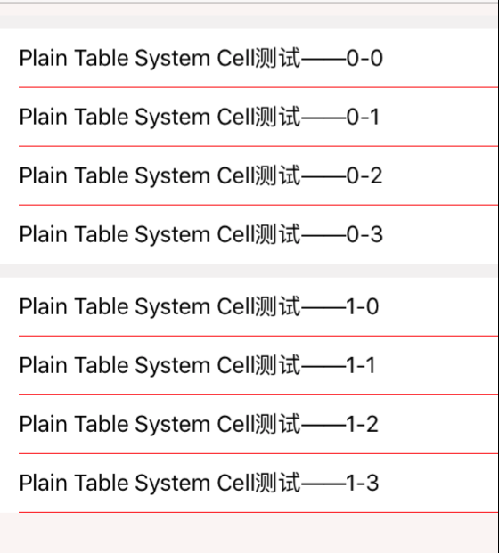   

 观察 View UI Hierarchy 如图：  

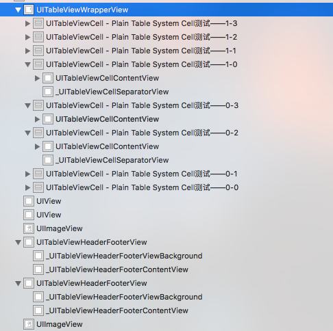   

在添加 header 或者 footer 后，与其相邻的 cell 的分隔线会被替换掉。那么问题就简单了，在使用 header 作为分隔时，由于最后一个 section 的最后一个 cell 是没有相邻 header，因此分隔线会被保留，所以，使用 footer 作为间隔可以达到我们预期的效果。至此，已经完成了大部分的视觉效果，还剩下一个去除 header 或者 footer 粘滞性的效果，很简单，通过重载以下函数便可以完成：  

```objc  
- (void)scrollViewDidScroll:(UIScrollView *)scrollView{
    /** 修改成自己的组头高度就可以了 */
    CGFloat sectionHeight = self.height;
    if (scrollView == self.tableView) {
        if (scrollView.contentOffset.y <= sectionHeight && scrollView.contentOffset.y >= 0) {
            scrollView.contentInset = UIEdgeInsetsMake(-scrollView.contentOffset.y, 0, 0, 0);
        } else {
            if(scrollView.contentOffset.y >= sectionHeight) {
                scrollView.contentInset = UIEdgeInsetsMake(-sectionHeight, 0, 0, 0);
            }
        }
    }
}
```  

至此，完成了预期 table 的视觉效果，为什么仅仅是视觉效果呢？因为，如果 table 是可以编辑的话，会有以下效果：  

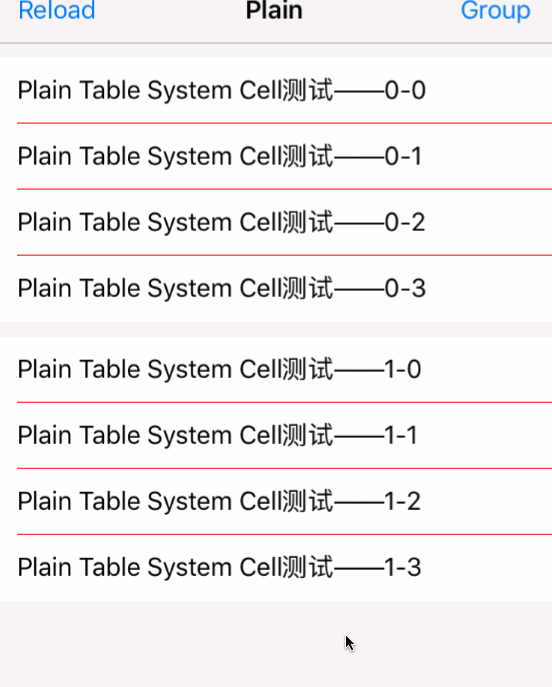  

这个效果异常坑爹，原本组织好的 UI 一旦编辑，瞬间显示的毫无章法…目前只能确定这个多出来的线确实是 cell 的分隔线，而且是那个系统已经帮我们隐藏的分隔线，在删除后的重绘中又被添加到界面，而且是顶到头，没有15像素的偏移，期待有大神可以解答这个问题…  

### 3、听说你是万能药——自定义分隔线  

自定义 cell 的话，可以自己决定分割线的位置和样式，因为可以获得分割线的实力，无论怎么调整都可以，不过需要增加一个控制参数。最近在项目中碰到了一个很奇怪的问题，这些 cell 便是自定义的分割线：  

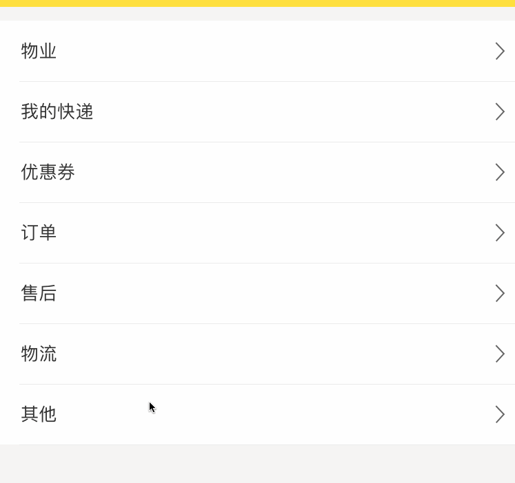  

在这个自定义 cell 中，我并没有添加控制参数，所有 cell 的分隔线都是默认显示的，但却在点选之后出现消失的情况。然而在之后的测试中，怎样都无法复现项目中的 bug。之后也查了很多资料，并没有遇到跟我情况类似的答案，唯一看到比较类似的是在滑动后消失的，具体解释：  

>分割线自定义在每个 cell 上，当 cell 复用的时候，只会读取你的数据模型的数据，但是分割线不会重新划线。  

解决办法则是重写自定义 cell 的 drawRect 方法。  

```objc
- (void)drawRect:(CGRect)rect {

    CGContextRef context = UIGraphicsGetCurrentContext();

    CGContextSetFillColorWithColor(context, [UIColor clearColor].CGColor);

    CGContextFillRect(context, rect);

    //上分割线，
    //CGContextSetStrokeColorWithColor(context, COLORWHITE.CGColor);
    //CGContextStrokeRect(context, CGRectMake(5, -1, rect.size.width - 10, 1));

    //下分割线
    CGContextSetStrokeColorWithColor(context,SeparateLineColor.CGColor);
    CGContextStrokeRect(context,CGRectMake(10, rect.size.height-1, SCREEN_WIDTH-20,1));
}
```  

这样画出的 cell 就会超过1个像素，会比平时的 cell 看起来粗，想要调整 cell 的高度可以参考这篇文章[iOS 绘制 1 像素的线](http://www.cnblogs.com/smileEvday/p/iOS_PixelVsPoint.html)。  

重载 drawRect 确实可以解决点选 cell 消失的问题，但是我还是觉得并不是复用导致了分隔线消失的，而在之后的测试中也并没能复现，还需要继续排查。这个 bug 也让我意识到，有时候自定义分隔线也并没有像想象中那么容易掌控，因此，我又恢复了这个界面的分隔线，而删去了自定义分隔线😂。  

最后，还有一条想说的是，如果需要自定义分隔线，把分隔线加到 cell 的顶部比加到底部更好，因为相比获取起始 cell 的位置，获取最后一个 cell 位置更容易出错。
