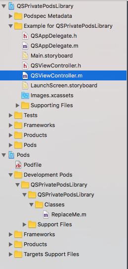
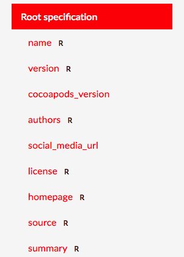
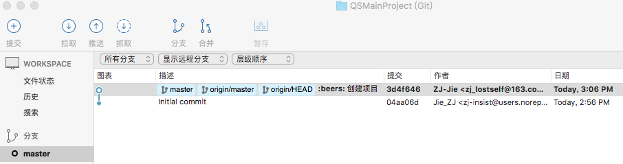
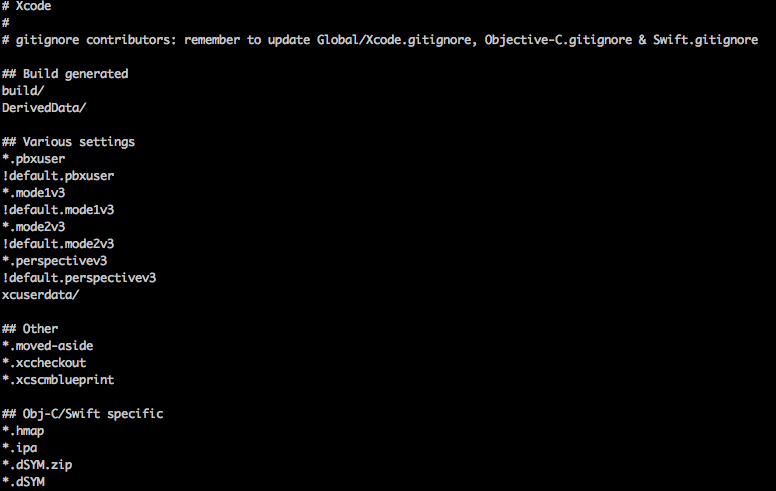
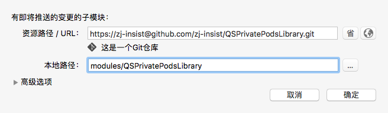
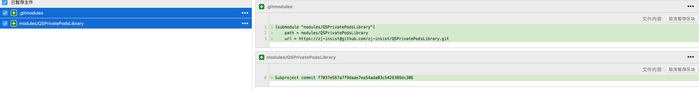
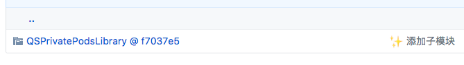
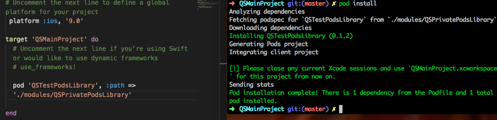
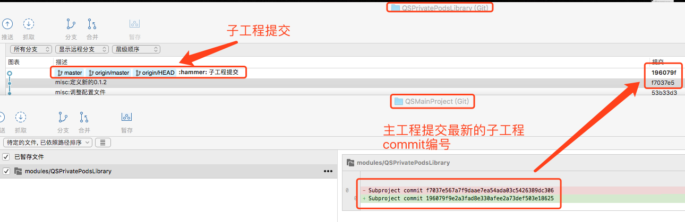

# 私有Pods创建以及工程模块化实践  

最近，项目中需要做一个独立性的基础模块，目的是要配置成第三方库类似的使用模式，没有业务依赖，但是引用便捷。当前，iOS开发中通常都是使用CocoaPods维护项目中的第三方库，之前也曾接触过使用Pods管理项目子模块的项目，但当时对CocoaPods都是似懂非懂，也没有深入的研究。现在刚好借助这个机会了解Pods的整个运行机制。  

## 私有Pods创建以及维护  

创建私有pods，CocoaPods的官网有相当明确的文档，网上也有很多的博客整理，总结之后大致可以分为以下几个步骤：  

1.创建与添加私有Specs Repo  
2.创建私有Pods工程文件  
3.对私有Pods的Podspec文件进行配置  
4.推送私有Pods的Podspec文件至私有Repo  
5.使用与维护  

#### 1. 创建与添加私有Specs Repo  

关于什么是Specs Repo，可以简单的理解为配置文件仓库。Pods的Search、Insatll、update等操作都依赖这个Specs Repo。官方提供了 `pod repo list` 用于查看当前Cocoapods下的所有Specs Repo，输入命令可以看到以下内容：  

```zsh   
master
- Type: git (master)
- URL:  https://github.com/CocoaPods/Specs.git
- Path: /Users/apple/.cocoapods/repos/master

QSPrivateRepo
- Type: git (master)
- URL:  https://github.com/zj-insist/PrivatePodsRepo.git
- Path: /Users/apple/.cocoapods/repos/QSPrivateRepo

XGTCPrivatePodsRepo
- Type: git (master)
- URL:  ****
- Path: /Users/apple/.cocoapods/repos/XGTCPrivatePodsRepo

3 repos
```  

私有库进行部分打码…我之前添加过两个repo，通常状态下只有一个master的repo，而这个master正是pods官方支持的所有第三方库的repo。三个repo都有一个相同的path前缀，我们切换到.cocoapods文件夹下使用tree命令查看这个目录的文件结构，关于tree命令的相关内容，可以点击[这里](http://yijiebuyi.com/blog/c0defa3a47d16e675d58195adc35514b.html)查看。

```zsh  
➜  .cocoapods tree -L 5
.
└── repos
    ├── QSPrivateRepo
    │   ├── QSTestPodsLibrary
    │   │   ├── 0.1.0
    │   │   │   └── QSTestPodsLibrary.podspec
    │   │   └── 0.1.1
    │   │       └── QSTestPodsLibrary.podspec
    │   └── README.md
    ├── XGTCPrivatePodsRepo
    │   ├── README.md
    │   └── XGJSBridgeLibrary
    │       ├── 0.1.1
    │       │   └── XGJSBridgeLibrary.podspec
    │       ├── 0.1.2
    │       │   └── XGJSBridgeLibrary.podspec
    │       ├── 0.1.3
    │       │   └── XGJSBridgeLibrary.podspec
    │       ├── 0.1.4
    │       │   └── XGJSBridgeLibrary.podspec
    │       └── 0.1.5
    │           └── XGJSBridgeLibrary.podspec
    └── master
        ├── CocoaPods-version.yml
        ├── README.md
        └── Specs
```  

截去master中过长的内容，可以看到其中主要包含每个repo中包含的库和其对应版本的配置文件。由于在安装pods的时候我们便已经将master clone到本地，因此我们可以对pods中支持的库进行常规的pods操作。那么要建立私有库的步骤就很明显了：创建自己的repo->clone这个repo->添加私有库的配置文件到这个repo。这样，就能像操作常规的第三方库一样操作我们自己创建的私有库了。  

创建自己的repo首先需要一个git仓库，如何创建根据自身需求，这里作为例子使用GitHub；创建完成后clone这个repo到本地，使用如下命令：  

```zsh  
  # pod repo add [Private Repo Name] [GitHub HTTPS clone URL]
  ➜ pod repo add QSPrivateRepo https://github.com/zj-insist/PrivatePodsRepo.git
```  

repo的名称并不需要跟git仓库中的一样，可以使用自定义名称。repo仓库并不需要所有项目的参与者都在本地添加，其主要作用是为了更新私有库的版本号以供使用者更新。如果只有一个人维护私有库版本，则只需维护者添加这个repo，参与这个repo的push工作，使用者只需在podfile中进行相关配置便可正常使用。  


#### 2. 创建私有Pods工程文件  

这一步，最简单的方法便是创建一个文件夹，然后把工程文件放入这个文件夹，最后，创建一个远程git仓库，管理这个工程。至此，便完成了第二步。  

此外，pods中也集成了创建pods项目的命令，并帮助我们完成相关配置文件以及example工程的创建。切换目录到要创建工程的文件夹，然后运行如下命令：  

```zsh   
 # pod lib create [Private Pods Name]
 ➜ pod lib create QSPrivateLibrary
```   

之后在终端中，会被询问如下问题：  

```zsh
What language do you want to use?? [ Swift / ObjC ]
 > ObjC

Would you like to include a demo application with your library? [ Yes / No ]
 > Yes

Which testing frameworks will you use? [ Specta / Kiwi / None ]
 > None

Would you like to do view based testing? [ Yes / No ]
 > No

What is your class prefix?
 > QS

```  

创建的项目，目录结构如下：  

```zsh   
.
├── Example
│   ├── Podfile
│   ├── Podfile.lock
│   ├── Pods
│   ├── QSPrivatePodsLibrary
│   ├── QSPrivatePodsLibrary.xcodeproj
│   ├── QSPrivatePodsLibrary.xcworkspace
│   └── Tests
├── LICENSE
├── QSPrivatePodsLibrary
│   ├── Assets
│   └── Classes
├── QSPrivatePodsLibrary.podspec
├── README.md
└── _Pods.xcodeproj -> Example/Pods/Pods.xcodeproj
```   

由于我在创建中选择生成example工程，系统为我创建了一个Demo工程，此外需要额外关注的是QSPrivatePodsLibrary文件夹，以及QSPrivatePodsLibrary.podspec文件。前者是私有库的库文件，包括代码文件以及资源文件，除了系统自动生成的文件夹，我们可以根据自身需求创建文件夹；而后者则是CocoaPods配置文件，pods的工作都是依赖这个文件，具体内容会在下一节介绍。  

最后，额外关注一下Example工程的Podfile文件，内容如下：  

```ruby  
use_frameworks!

target 'QSPrivatePodsLibrary_Example' do
  pod 'QSPrivatePodsLibrary', :path => '../'

  target 'QSPrivatePodsLibrary_Tests' do
    inherit! :search_paths
  end
end
```  

再看一下在Xcode工程下的目录结构：  
  

因为在Podfile中使用本地路径引入的第三方库，所以第三方库以Development Pods的形式引入项目，两者的主要区别是Development Pods中的代码是可以更改的，而Pods中的内容更改是被锁定的。根据命名和特性也很明显，Development Pods主要用于第三方或私有库的开发，Pods则主要是管理第三方库。  

创建好目录和私有库必要的文件，编写好私有库功能，然后将私有库中的文件推送到git；此外，还要给项目添加一个tag，用于标示私有库的版本，这个tag需要和podspec中配置的version对应。CocoaPod在管理私有库时，会根据podsepc文件中的version获取项目对应tag的版本，以此达到版本控制的目的。如果在podspec中配置的版本在项目中没有对应的tag，则podspec文件的验证会无法通过。  

简单来说，修改私有库上传git后，需要给这个上传的版本打上一个tag，同步的，要更新这个私有库中podsepc文件中的version为这个tag的值。    

#### 3. 配置Podspec文件  

完成了私有库功能的编写，剩下就是把创建的私有库集成到CocoaPods。CocoaPods管理第三方库主要是依赖podspec文件中的配置，这一步要做的便是在私有库目录下创建podspec文件并按照官方定义的规范编写。pods中同样也集成了生成podspec文件的功能，使用如下命令创建podspec文件：  

```zsh
pod spec create [PodsName] [GitHub HTTPS clone URL]
```  

PodsName为私有库名称，GitHub中的内容选填可不填，也可输入一个项目地址，CocoaPods会自动将项目中的部分信息填充到podspec文件，使用如下命令生成模板文件：  

```zsh
pod spec create test https://github.com/zj-insist/QSPrivatePodsLibrary.git
```

从[这个](https://github.com/zj-insist/QSPrivatePodsLibrary)项目地址生成名为test的podspec文件，删掉部分非必要配置，生成的模板文件如下：  

```ruby
Pod::Spec.new do |s|
  s.name         = "test"         #名称
  s.version      = "0.1.1"        #版本号
  s.summary      = "私有pods测试"  #简介
  #项目描述
  s.description  = <<-DESC       
                  这里填充项目描述
                   DESC

  s.homepage     = "https://github.com/zj-insist/QSPrivatePodsLibrary"  #主页

  #license相关信息
  s.license      = "MIT (example)"
  # s.license      = { :type => "MIT", :file => "FILE_LICENSE" }

  #作者相关信息
  s.author             = { "Jie_ZJ" => "email@address.com" }
  # s.authors            = { "Jie_ZJ" => "email@address.com" }

  #支持系统及版本相关信息
  s.platform     = :ios

  #项目地址及引用版本
  s.source       = { :git => "https://github.com/zj-insist/QSPrivatePodsLibrary.git", :tag => "#{s.version}" }

  #文件及资源文件配置
  s.source_files  = "Classes", "Classes/**/*.{h,m}"
  # s.resources = "Resources/*.png"

  #动态库以及静态库配置
  s.framework  = "SomeFramework"
  # s.frameworks = "SomeFramework", "AnotherFramework"
  s.library   = "iconv"
  # s.libraries = "iconv", "xml2"

  #项目相关配置，编译环境、第三方库依赖等
  s.requires_arc = true
  s.dependency "JSONKit", "~> 1.4"

end
```   
[官方文档](https://guides.cocoapods.org/syntax/podspec.html#group_root_specification)中有更多更详细的说明，文档目录中还很友好的使用`R`标示必填内容：  

  

根据官方文档编写好podspec文件，在上传之前还需要通过验证，否则无法完成上传，切换到包含podspec文件的目录，使用命令：  

```zsh
pod spec lint --allow-warnings  
#以下命令也可验证podspec文件，但是只适用于本地podspec文件的验证，不适用于推送到远端的podspec验证，关于区别会在之后说明
#pod lib lint --allow-warnings  
```  

`--allow-warnings`参数可有可无，但是验证的标准似乎比较严格，很多对项目毫无影响的问题也会造成验证不通过，如果没有对项目有影响的警告信息，建议使用该参数通过验证。通过后，会有如下提示信息：  

```zsh
 -> QSTestPodsLibrary (0.1.1)
    - WARN  | summary: The summary is not meaningful.
    - WARN  | description: The description is shorter than the summary.

Analyzed 1 podspec.

QSTestPodsLibrary.podspec passed validation.
```  

验证通过后，一个可使用CocoaPods管理的私有库便创建完成。  

#### 4. 共享私有库

完成私有库的创建后，要实现私有库的共享。这时，需要使用第一步创建的私有repo，这个repo就是存储我们创建的私有库配置文件的仓库，在命令行推送已经通过验证的podspec文件到repo：  

```zsh
pod repo push [Location RepoName] [Podspec Name] --allow-warnings
```  

这里需要注意的是，push的repo名字是在本地创建的名字，pod会从本地的名字索引git地址，如果此处名字和本地不匹配，则推送不成功，这也是管理私有repo需要把这个repo clone到本地的原因。添加`--allow-warnings`参数的原因和验证时一致，此处不赘述。  

推送成功后，可以在添加过包含这个私有库的repo中使用pods的查询操作查询这个库：  

```zsh
QSPrivatePodsLibrary git:(master) pod repo push QSPrivateRepo QSTestPodsLibrary.podspec

Validating spec
 -> QSTestPodsLibrary (0.1.1)
    - WARN  | summary: The summary is not meaningful.
    - WARN  | description: The description is shorter than the summary.

-> QSTestPodsLibrary (0.1.1)
   A short description of QSTestPodsLibrary.
   pod 'QSTestPodsLibrary', '~> 0.1.1'
   - Homepage: https://github.com/zj-insist/QSPrivatePodsLibrary
   - Source:   https://github.com/zj-insist/QSPrivatePodsLibrary.git
   - Versions: 0.1.1, 0.1.0 [QSPrivateRepo repo]
```  

至此，一个私有的CocoaPod仓库创建完成，只要在Podfile中进行一些配置，便可像使用第三方仓库一样使用我们自己的私有库。  

#### 5. 私有库的使用和维护  

如果上面的四步都顺利通过，则进入了私有库的分发过程。在Podfile编写好要引用的库，然后执行pod install会提示找不到我们创建的私有库，这是因为CocoaPod在搜寻私有库时会有一个source，而这个source默认为官方的源，我们创建的私有库没有添加到这个源，所以提示找不到。所以此时需要在Podfile文件开头添加我们创建的私有repo地址：  

```ruby
source 'https://github.com/zj-insist/PrivatePodsRepo.git'
```  

再运行，发现还是无法执行，提示官方源中的第三方库找不到，这是因为修改了源的地址为我们的私有repo，所以还要再添加一次官方的源：  

```ruby   
source 'https://github.com/CocoaPods/Specs.git'
source 'https://github.com/zj-insist/PrivatePodsRepo.git'
```  

这样，就可以像管理第三方库一样管理自己的私有库了。在私有库更新后，执行pod update同样可以完成私有库在引入项目中的更新。  

私有库的更新需要以下步骤：  
1. 在更新私有库代码后上传git，提交一个tag，然后同步的更新podspec中的version，确保这个version和tag一致。
2. 在本地验证更新后的podspec文件
3. 将验证通过后的podspec文件上传私有repo  

删除私有库不需要借助CocoaPods，只需要像操作普通git工程一样，切换到要删除的私有库目录，然后删除这个私有库的目录及内部配置文件，最后更新这个私有库的改动到远端，这样就完成了私有库的删除工作。当然，这个操作只是删除了私有库在repo中的配置信息，并没有对私有库的内容做改动，想添加回来只需再次push私有库的podspec文件到私有repo即可。  

第一部分只介绍了创建一个私有库的基本操作，还有比如使用子模块、创建framework以及静态库等技巧，有兴趣的可以更深入的了解一下。  

## 私有pods创建过程中的部分坑  

虽说根据教程创建私有库也就四步工作，但实际实践起来还是有很多坑的，遇到的坑做如下记录：  

1.tag移动对私有库的影响   

可能是对tag的理解不够深入，导致了一系列奇怪的问题，因为我使用sourceTree这种GUI的git管理工具，每次移动标签都会报标签已存在的错误，所以有些问题也不能确保就是移动标签造成的，很可能是我的标签没有移动到正确的位置…  

首先，一个比较明显的问题是，发布一个新版本后，不可以通过修改tag的位置更新私有库的内容。简单来说，发版后，这个tag就没卵用了，即使我这时候删除这个tag，私有库依然可以正常被引用。结合验证时需要项目中存在与version对应的tag号，否则不能通过验证分析，猜测CocoaPods内部存储了这个tag对应的commit编号，在上传完成后，这个编号固定，我们修改或者删除tag并不会对这个编号造成影响。tag只是对外的一种标示，真正使用的是commit编号。但是，我并没有在私有repo中找到存储commit编号的记录，所以以上为不负责猜测，有时间可以研究一下CocoaPods的实现。     

之后，还有一个出现过一次的问题，具体是，我把tag打在了commit编号为A的位置，然后验证podsepc发现有问题不通过，于是修改私有库再提交，这个commit编号为B。这时我不想重新打个tag，就把tag移动到B，之后提交验证，而这个时候验证的报错是我已经修改过的问题，就是验证的还是A位置的记录。具体原因不明，但是更新tag号可以解决这个问题，估计问题还是跟CocoaPods匹配tag和version的内部实现有关系。  

2.私有库依赖其他库的问题  

在私有库中引入第三方库头文件时，使用""而不是<>。  

当私有库依赖另一个私有库时，验证私有库时需要使用如下命令：  
```zsh
pod spec lint --sources='[Private Repo Sources]'
```  

具体可参考[这里](https://stackoverflow.com/questions/27303475/cocoapods-unable-to-find-a-specification-for-privatespec-depended-upon-by-pr)。  

3.pod lib lint和pod spec lint命令的区别  

pod lib lint只从本地验证podspec文件的合法性，而pod spec lint则是从本地和远端都进行验证  

根据需求使用两个命令，如果要上传远端，则需要使用pod spec lint  

4.私有库资源文件的引入方式  

具体可以参考[Cocoapods 使用私有库中遇到的坑](http://www.jianshu.com/p/1e5927eeb341)中的第6点，需要额外强调的是，如果使用xcassets存放图片资源，则在Podfile文件中不要包含`use_frameworks!`。  

## 工程模块化实践  

曾经也参与过使用Cocoapods + Submodule管理模块的项目，组内也开展过相应的分享讲解，当时因为接触CocoaPods不久，一场分享下来，除了听懂podspec的相关配置和模块化这个概念，并没有其他的收获。而在之后的业务中，因为只需要关注自身负责模块功能的开发，并不需要关注已配置好的环境，就没有再深入的了解。这也是我认为模块化的一项缺陷，在业务上确立界限固然是好事，但这样同样减少了了解非自身负责模块甚至整个项目架构的动力。  

首先明确一下模块化和组件化两个概念，根据网上的定义：  

模块化，从功能性上更偏向于拆分，将一个完整的项目根据一定规则拆分成不同的模块。而组件化则更强调复用，为了代码甚至是功能上的复用。其实简单来说，组件化是模块化更进一步的设计。  

>以下所说的模块化都是以组件化为目的的模块化。

#### 1. 模块化优势  

既然要模块化，当然要谈谈模块化的优势。自身觉得模块化的优势主要集中在以下几个方面：  

1. 明确开发边界，降低项目代码耦合  

这个优势并不能说是模块化的特性，而是因为模块化的过程中硬性的添加了这两项要求。模块的划分需要在设计之初明确，划分大小合适业务拆分到位的模块。一旦成功的划分主工程为几个模块，每个模块基本只需要关心自己内部的业务逻辑和少量的对外通讯。这对新加入团队的成员上手也有很大帮助，在将项目模块化后，不管是结构复杂度还是代码量，相对整个项目都小上几个数量级，这样可以帮助新人迅速的切入对应的模块，新人只需要对自身负责模块熟悉，掌握定义好的与其他模块通讯的协议，而并不需要关注其他模块的任何内容。  

2. 提高编译速度和测试效率  

拆分后的模块都有很强的独立性，可以搭建一个简单的壳工程进行开发和维护，而不需要放入庞大的主工程，这在编译和运行方面可以节省很多时间，此外，测试在一个模块更改后也不需要全量测试整个工程，只需要测试对应的模块和与其有通讯的内容。  

3. 提高问题排查效率  

模块化后问题会自动定位到了模块内部，缩小排查范围。  

4. 模块复用甚至功能复用  

可复用的模块应该叫做组件。也是因为复用的特性，组件化近两年被抄的火热。  

#### 2. 模块化存在的问题  

说完优势，当然要对应的讲一下问题，就目前来看，模块化还是存在很多未解决的问题：  

1. 入门门槛  

不管是模块设计、模块的管理以及协调各个模块，都需要在模块化时候了解更多的相关内容。  

2. 拆分粒度  

太细了花费太多精力在通讯，太粗了完全没起到模块化的意义。这点应该是模块化过程最需要注意的问题。  

3. 组件管理  

选择一种合适的方式统一管理和更新组件也是需要考虑的问题。  

4. 壳工程配置  

以上说到了模块化可以提高编译速度，是要建立在壳工程可以容易配置的前提下，如果壳工程的配置需要牵连太多内容还不如放到主工程开发。  

5. 太明确的边界导致对整个项目了解欠缺  

正如我在开头谈到的，太明确的界限，也隔绝了开发者对其他模块了解的积极性。  

### 3. CocoaPods + Submodule模块化实践  

关于模块化，我也只做了一点皮毛的了解，以自己的理解分析了优劣。如果想真正将工程模块化，还有很多内容需要了解，有兴趣的读者可以自己查阅相关内容。以下将从组件管理方面，讲述一下自身的实践经验。  

文章开头就在讲解私有库的创建，使用私有库管理模块是个不错的选择，但还是存在一些问题：  

1. 基础模块更新需要协同通知到每个模块，否则功能模块在使用上会存在编译问题。每次基础模块更新发版后，功能模块并不知道基础模块更新，需要一个个通知，如果有遗漏就会造成某个功能模块更新不及时导致主工程编译不通过，当模块多了之后，将是个很头疼的问题。  

2. pod update命令耗时相当之久，每次更新模块都使用update耗费大量时间。  

鉴于以上问题，Cocoapods提供的开发者模式可以帮我们一定程度上解决更新命令耗时太久的问题。如在私有库创建的example所示，只要在Podfile中使用本地路径：   

```ruby
 pod '库名', :path => '本地路径'
```  

便可使用CocoaPods的开发者模式，在Pods代码更新后主工程会有变更显示，只需在添加新文件和做出文件目录调整的情况下执行`pod install`即可，而无需执行`pod update`这种耗时较长的命令。  

使用开发者模式也仅仅做到了子工程更新同步给主工程，避免了子工程在主工程更新不及时的问题，但也无法对各个模块做出统一化管理，而且各个模块也都是拷贝到主工程下，这样git的提交操作同样是要在主工程完成。另一方面将，使用CocoaPods管理的工程也是Pods下的文件，而一般的开发中不会修改第三方库，所以Pods文件夹是被全局忽略的。将子工程和主工程分散到不同git，可以隔离主工程和子工程，那主工程又如何获取子工程的更新获取最新版本的子工程呢？这时，便要使用submodel了。  

这里主要介如何给一个项目添加子工程，并协调子工程和主工程协作，更多子工程相关信息，可以参考[这里](https://git-scm.com/book/zh/v2/Git-%E5%B7%A5%E5%85%B7-%E5%AD%90%E6%A8%A1%E5%9D%97)。以下使用SourceTree演示如何添加子工程和相关工作原理：  

首先，需要有两个项目，并分别上传至Git，主工程[Demo](https://github.com/zj-insist/QSMainProject)，子工程[Demo](https://github.com/zj-insist/QSPrivatePodsLibrary)，主工程Git：  

  

然后随手在Git中随手加入gitignore文件忽略非必要文件的追踪：  

   

之后，为项目添加子工程。sourceTree中右键`子模块`创建，然后再配置子模块的远程地址和本地路径，一般来说，子模块都是配置到modules中的，当然，也可以自己随意命名：    

  

配置后，会提示有如下两条变更：  

  

一个是git相关配置信息，另一个和子模块相关，最后的字符串是子工程的commit编号，这个编号是主工程索引子工程的关键。提交主工程，打开GitHub查看项目结构，进入modules文件夹：   

  

子模块的文件夹样式和普通文件夹不一样，而且后面跟着的也是一串字符，这串字符就是在提交记录中的子工程commit编号，点击子工程文件夹，会被索引到子工程的git目录，这也表明主工程只是保留了子工程的git配置以及commit提交编号，项目编译时也是从对应的commit编号寻找对应的项目文件。  

子工程配置完成后，使用CocoaPads开发者模式配置Podfile文件，然后执行`pod install`。

  

最后使用`xcworkspace`文件打开项目，就可看到主工程以开发者模式引用着子工程。至此，便完成了使用CocoaPods管理子工程的所有步骤。之后开发流程：在子工程中开发->提交子工程修改->切回主工程git->在主工程中提交最新的子工程commit编号。  

   

**在提交主工程时，一定要确保子工程的commit是你想提交的那个。**  

如果没有每一次确认commit编号，很可能会出现子工程回滚的情况。这个问题跟Git的子工程的相关机制有关系，具体可参考[这里](http://blog.devtang.com/2013/05/08/git-submodule-issues/)。  

其实，简单点讲，就是在每次提交主工程时，子工程的处在哪个分支，就会提交这个分支的最新commit编号。但是这个地方有个坑，主工程在切换分支时，会使子工程的分支悬浮到`HEAD`上，而这个`HEAD`中的最新commit编号，很可能被回滚到一个比较老的版本。这是，把子工程分支切换到你要提交的位置，这个回滚就会消失。  

把开发分支拉倒本地后，我一般会再拉出一个分支，在这个拉出的分支开发完成后，再合并到开发分支。在拉出来的分支提交最新的commit编号，然后合并到开发分支，这个过程中通常就会出现子工程分支悬浮在`HEAD`上，然后开发分支就会出现子工程的回滚提交，这个时候变更一下子工程分支或者重置这个提交即可。  

**最后，在开发子分支时，一定要确保子工程分支没有悬浮在`HEAD`。在开发之前发现分支悬浮在`HEAD`，直接切换到开发分支即可；如果在提交时发现悬浮在`HEAD`，此时一定不要提交或者变更分支，而要使用Git的`暂存`功能，先暂存当前的开发进度，然后切换到正常分支在应用贮藏。**  

如果要问为什么这么操作，等你丢失了一下午的修改提交估计就明白了😂。  


### 参考  

[使用 Cocoapods 创建私有 podspec](http://blog.wtlucky.com/blog/2015/02/26/create-private-podspec/)  

[使用私有 Cocoapods 仓库 中高级用法](http://www.jianshu.com/p/d6a592d6fced)  

[蘑菇街 App 的组件化之路](http://limboy.me/tech/2016/03/10/mgj-components.html)  

[iOS 应用架构谈 组件化方案](https://casatwy.com/iOS-Modulization.html)  

[Git 工具 - 子模块](https://git-scm.com/book/zh/v2/Git-%E5%B7%A5%E5%85%B7-%E5%AD%90%E6%A8%A1%E5%9D%97)  

[Cocoapods 使用私有库中遇到的坑](http://www.jianshu.com/p/1e5927eeb341)  

[Git submodule 的坑](http://blog.devtang.com/2013/05/08/git-submodule-issues/)  


